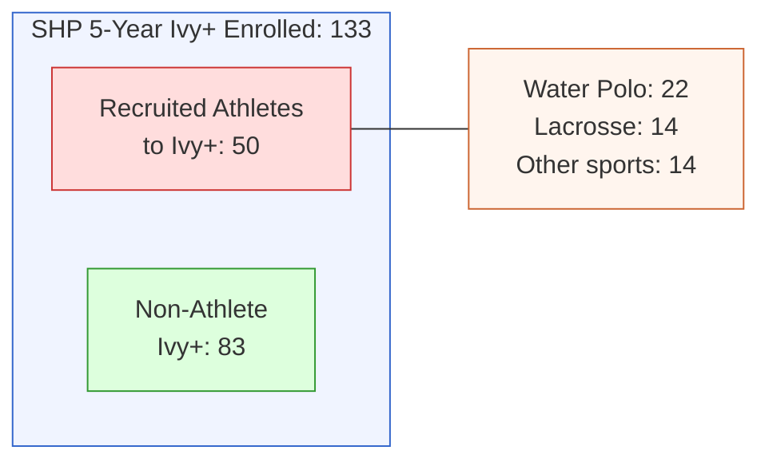
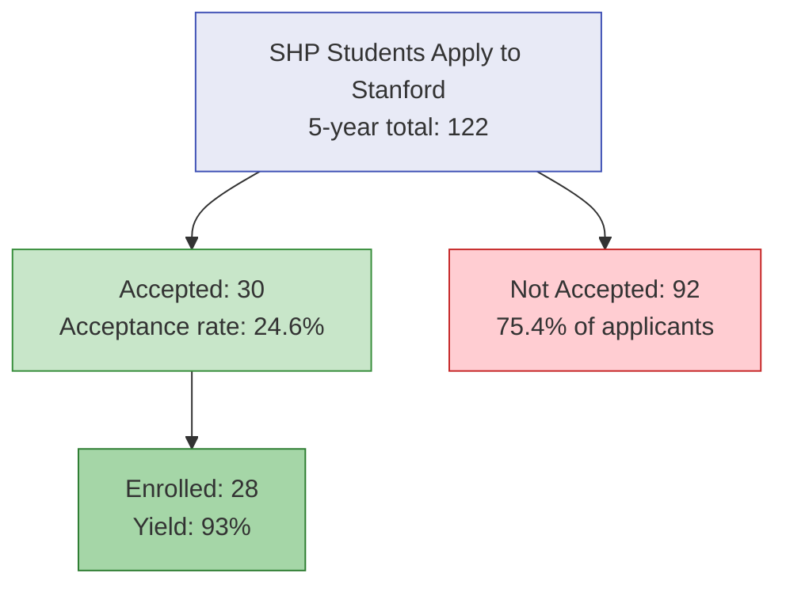
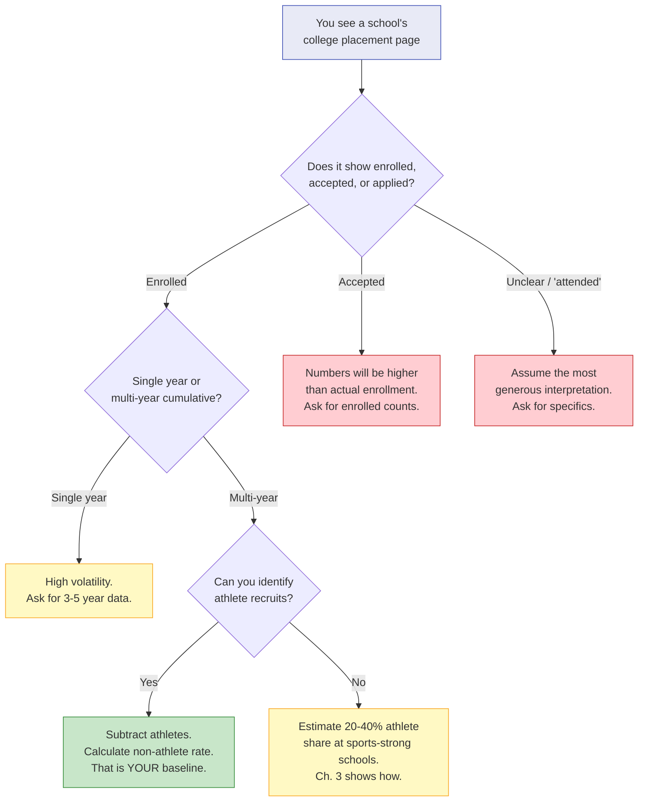

# Chapter 1: What the Brochure Doesn't Say

> **Who this chapter is for:** T1 readers — parents who are new to college placement data and just starting to wonder what their school's numbers actually mean. No prior knowledge assumed.

School placement data is real. It is also structurally misleading. Learning to read it — really read it — is the most important skill a Bay Area parent can develop. This chapter teaches that skill, using one school's data to show how every school's numbers work.

---

You are sitting at your kitchen table on a Sunday night, laptop open, a glass of something next to it. Your kid is in third grade at a well-regarded Bay Area private school. You just came back from a dinner where another parent mentioned — casually, as if discussing the weather — that their school sends twenty-eight kids to Stanford. Twenty-eight. You pull up your school's college placement page. The list is long. Harvard, Yale, Princeton, Stanford, MIT. Names you recognize, names that feel like destinations. The page is designed to impress, and it works.

Then you do what every data-literate Bay Area parent eventually does: you start counting. You start asking questions the page doesn't answer. And that is where this chapter begins.

---

## The Headline Numbers

Let's use a real school. Sacred Heart Preparatory in Atherton publishes one of the most detailed college placement datasets of any Bay Area private school — five years of data (2021-2025), with applied, accepted, and enrolled counts for each college. [A]

Here is what the headline looks like:

| Year | Class Size | Ivy+ Enrolled | Ivy+ Rate |
|------|-----------|---------------|-----------|
| 2021 | 155 | 28 | 18.1% |
| 2022 | 155 | 25 | 16.1% |
| 2023 | 171 | 28 | 16.4% |
| 2024 | 149 | 30 | 20.1% |
| 2025 | 160 | 22 | 13.8% |
| **5-yr avg** | **158** | **26.6** | **16.8%** |

Ivy+ here means the eight Ivies plus Stanford, MIT, Caltech, Duke, UChicago, Northwestern, Johns Hopkins, and Georgetown — the schools most parents are mentally benchmarking against. [E]

Those are strong numbers. Nearly one in six graduates enrolling at an Ivy+ school, every year, for five years. Twenty-eight students enrolled at Stanford over that period. If you are a parent reading this page, your takeaway is clear: this school gets kids into top colleges.

That takeaway is not wrong. But it is incomplete.

---

## The First Crack: Athletes

Sacred Heart is unusual in one important way: it publishes annual athlete commitment lists. Most schools don't. This means SHP is the only school in our dataset where we can decompose Ivy+ placements into recruited athletes and everyone else. [A]

**Figure 1.1:** SHP five-year Ivy+ placements decomposed by athlete recruitment status. Water polo and lacrosse account for 36 of 50 athlete-to-Ivy+ commits.

Here is the same table, with the athlete layer visible:

| Year | Class Size | Total Ivy+ | Athletes to Ivy+ | Non-Athlete Ivy+ | Headline Rate | Non-Athlete Rate |
|------|-----------|-----------|-------------------|-------------------|--------------|-----------------|
| 2021 | 155 | 28 | 3 | 25 | 18.1% | 16.1% |
| 2022 | 155 | 25 | 20 | 5 | 16.1% | 3.2% |
| 2023 | 171 | 28 | 8 | 20 | 16.4% | 11.7% |
| 2024 | 149 | 30 | 13 | 17 | 20.1% | 11.4% |
| 2025 | 160 | 22 | 6 | 16 | 13.8% | 10.0% |
| **5-yr** | **790** | **133** | **50** | **83** | **16.8%** | **10.5%** |

The five-year headline Ivy+ rate is 16.8%. Remove recruited athletes, and it drops to 10.5%. That is a six-percentage-point gap — more than a third of the headline number.

Two sports dominate this pipeline. Water polo sent 22 athletes to Ivy+ schools over five years — including 10 to Stanford alone. Lacrosse sent 14, primarily to Duke, Georgetown, Princeton, and Brown. Together, these two sports account for 72% of all athlete-to-Ivy+ commits from SHP. [A]

Consider this micro-case. A family we'll call the Chens moved to the Peninsula from the South Bay when their daughter was in fifth grade. They chose SHP partly because of the college placement numbers — nearly 17% Ivy+ rate, Stanford as the top destination. Their daughter is a strong student, plays violin, does robotics. She does not play water polo or lacrosse. The Chens' realistic baseline is not 16.8%. It is closer to 10.5%. That is still a strong number. But it is a different number than the one that influenced their school choice.

---

## The Stanford Question

Stanford deserves its own section because it is the number every Peninsula parent looks at first.

| Year | Applied from SHP | Accepted | Enrolled | Athlete Commits to Stanford |
|------|-----------------|----------|----------|-----------------------------|
| 2021 | 29 | 5 | 5 | 0 |
| 2022 | 23 | 8 | 8 | 8 |
| 2023 | 24 | 7 | 5 | 1 |
| 2024 | 20 | 3 | 3 | 0 |
| 2025 | 26 | 7 | 7 | 1 |

Look at 2022. Eight students from SHP enrolled at Stanford. All eight had athletic commitments — seven in water polo, one in lacrosse. The non-athlete Stanford enrollment that year was zero. [A]

In 2021, by contrast, five students enrolled at Stanford with zero identified athletic commits. In 2025, seven enrolled, of whom one was a recruited water polo player — leaving six non-athlete admits.

The five-year total: 28 SHP graduates enrolled at Stanford. Of those, 10 were recruited athletes (all in water polo or lacrosse). The non-athlete count is 18 — an average of 3.6 per year from a class of 158.

That is a 2.3% non-athlete Stanford enrollment rate. Real, but very different from the impression created by "28 students went to Stanford."

---

## The Second Crack: Applied, Accepted, Enrolled

Most school placement pages list colleges where graduates "matriculated" or "enrolled." Some list where graduates were "accepted." A few — SHP among them — publish all three: applied, accepted, and enrolled. [A]

These are different numbers, and the gaps between them tell you different things.

**Figure 1.2:** The funnel from application to enrollment at Stanford for SHP students (2021-2025 combined). Nearly three-quarters of SHP applicants to Stanford are not accepted.

A school that reports "accepted" will show a bigger list than one that reports "enrolled." A school that reports a cumulative five-year list without specifying years will show the biggest list of all. When you see a college placement page, the first question to ask is: what is this page actually counting? [E]

Consider a second micro-case. A family we'll call the Patels are touring a private school. The admissions team shows a slide: "Our graduates have been accepted to Harvard, Stanford, MIT, Yale..." The list is long and impressive. But "have been accepted to" over an unspecified time window could mean two students across ten years. Without knowing the denominator (class size), the numerator (how many), and the timeframe (which years), the list is atmosphere, not data. The Patels, both engineers, start asking those questions. The admissions officer has not been asked them before.

---

## The Third Crack: Year-to-Year Volatility

College placement is not a stable output. It varies significantly from year to year, driven by the specific students in each graduating class, admissions office priorities that shift annually, and randomness that no school can control. [E]

SHP's data makes this visible:

- In 2024, SHP's Ivy+ rate was 20.1% — the highest in five years.
- In 2025, it dropped to 13.8% — the lowest in five years.
- The non-athlete Ivy+ rate swung from 16.1% in 2021 to 3.2% in 2022 to 11.7% in 2023.

The 2022 anomaly is worth understanding. That year, SHP had 40 athletes commit to play college sports — the highest of any year in the dataset. Twenty of them went to Ivy+ schools. The class of 2022 happened to have an extraordinarily deep water polo cohort, with players committed to Stanford, Princeton, and Brown. That single-sport pipeline produced a year where nearly all Ivy+ placements were athletes.

No parent looking at SHP's cumulative five-year numbers would see this. The five-year average smooths it into a clean 16.8%. But if your child graduated in 2022 and was not a recruited athlete, the Ivy+ rate that mattered to your family was 3.2%, not 16.8%.

The lesson is not that 2022 was a bad year. It is that any single year's data can be dominated by factors unrelated to the school's academic program. A school with a strong water polo pipeline will have years where the Ivy+ count spikes because of athletic recruitment. A school with a small graduating class will have years where a handful of exceptional students drive the numbers up — and years where they don't. [E]

This is why this guidebook uses five-year windows wherever possible, and why Chapter 2 teaches you to ask for multi-year data when a school shows you a single year.

---

## What This Chapter Is Not Saying

This chapter is not saying schools are lying. SHP publishes more data than almost any peer school. The numbers on their placement page are accurate. [E]

This chapter is not saying athlete recruitment is unfair, illegitimate, or bad. Recruited athletes earned their spots through years of training. Families who invest in athletics have made a strategic choice, and it pays off in admissions. That is data, not a judgment.

This chapter is not saying SHP is a bad school. SHP's non-athlete Ivy+ rate of 10.5% is strong by any standard. The school's willingness to publish granular data is a mark of confidence.

What this chapter is saying: **the headline number on any school's placement page is a composite.** It blends athletes and non-athletes, single-year spikes and multi-year averages, acceptances and enrollments. Once you learn to see the structure inside the composite, you can read any school's data accurately — and make better decisions for your family.

---

## What This Means for Your Family

A third micro-case. A family we'll call the Nguyens have a first grader at a Bay Area private school. They came to the school partly because of its placement record. After reading this chapter, they feel something between deflated and relieved. The numbers are still good — just different from what they assumed.

Here is what changes when you see the structure:

**You stop comparing headline numbers across schools.** One school's "18% Ivy+ rate" might include 40% athletes. Another school's "12% Ivy+ rate" might include zero athletes. The second school may actually be placing more non-athlete students into Ivy+ colleges. You cannot compare without decomposing.

**You start asking better questions at school tours.** Not "where do your graduates go?" but "how many of your Ivy+ placements last year were recruited athletes?" and "can you share year-by-year data, not just cumulative?" Most admissions teams have never been asked. Some will answer. Some won't. Both responses are informative. [E]

**You recalibrate your expectations.** If your child is not a recruited athlete — and statistically, most children are not — the number that matters is the non-athlete placement rate. At SHP, that is 10.5% over five years. At schools that don't publish athlete data, you will need to estimate. Chapter 3 shows you how.

**You gain perspective.** A 10% non-athlete Ivy+ rate at a private school is real. It means roughly one in ten non-athlete graduates enrolls at a top-16 university. That is meaningfully higher than the national average. It is also not 17%, and the difference matters when you are making a $50,000-per-year decision.

**Figure 1.3:** Decision tree for reading any school's college placement page. Start at the top; follow the branches to understand what the numbers actually mean for a non-athlete family.

---

## Quick Reference

| What you see | What to ask | Why it matters |
|-------------|-------------|----------------|
| "28 students went to Stanford" | How many were recruited athletes? | At SHP, 10 of 28 were. The non-athlete number is 18 over 5 years. |
| "18% Ivy+ rate" | Is that for one year or multiple? Athletes included? | SHP's 16.8% headline drops to 10.5% without athletes. |
| "Our graduates attend Harvard, Yale, Stanford..." | How many per year? Enrolled or accepted? | A cumulative list over 10 years tells you very little about this year's class. |
| Strong single-year numbers | What were the other years? | SHP's non-athlete rate ranged from 3.2% to 16.1% in the same five-year window. |
| No athlete data published | Does the school have strong sports pipelines? | Schools with D1 water polo, lacrosse, or rowing often have athlete-heavy Ivy+ counts. |
| Applied vs. accepted vs. enrolled | Which number is on the page? | SHP: 122 applied to Stanford over 5 years, 30 accepted, 28 enrolled. Each tells a different story. |

---

## Chapter Evidence Note

This chapter relies primarily on **Tier A** (official school data) and **Tier E** (author synthesis) evidence.

**Tier A claims:** SHP class sizes, Ivy+ enrollment counts, athlete commitment lists, Stanford applied/accepted/enrolled numbers — all from SHP's published school profiles, college placement documents, and athlete commitment pages (2021-2025). These are official school publications and are verified against multiple source documents.

**Tier E claims:** The interpretation that headline placement data is "structurally misleading," the non-athlete rate calculation methodology, the recommendation to decompose athlete vs. non-athlete placements, and the year-to-year volatility analysis — these are author synthesis based on the Tier A data. The decomposition math is straightforward, but the framing and recommendations reflect the author's judgment about what matters for non-athlete families.

*All school data in this chapter is from official SHP publications covering graduating classes 2021-2025. Athlete commitment data is from SHP's published annual athlete pages. Class sizes are from SHP school profile PDFs filed with college counseling offices. Before making decisions based on specific numbers, verify with current school publications.*
