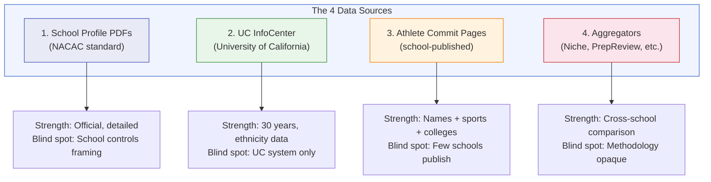
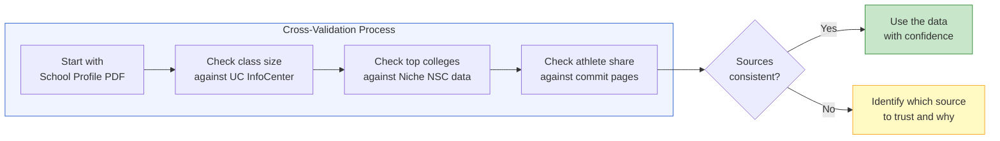
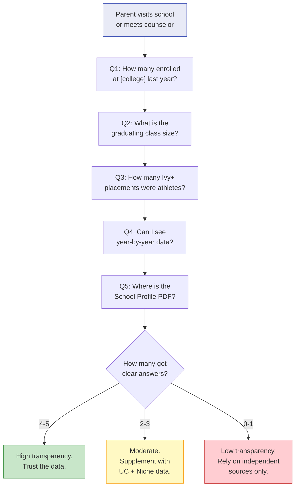

# Chapter 2: How to Read School Placement Data

> **Who this chapter is for:** T1-T2 readers — parents who want to do their own research on college placement. Once you know the four source types and what each one hides, you can evaluate any school's data yourself.

Every Bay Area private school publishes college placement data. None of them publish it the same way. Learning to navigate the differences — and to cross-check one source against another — is the skill that separates a parent who *consumes* school marketing from a parent who *evaluates* it. This chapter gives you the taxonomy.

---

You are trying to compare two schools. Menlo School's profile says 30 graduates enrolled at Stanford over three years. [A] Harker's college counseling page says 34 graduates enrolled at Stanford — also over three years. [A] The numbers look close. You could conclude these schools have similar Stanford placement rates.

But Menlo's "three years" means the classes of 2023-2025. Harker's "three years" means the classes of 2023-2025. So far so good. Now look deeper. Menlo has class sizes of roughly 143. Harker's upper school graduates roughly 280 per year. [A] Thirty Stanford enrollees from 429 Menlo graduates (three classes) is a 7.0% rate. Thirty-four Stanford enrollees from roughly 840 Harker graduates is 4.0%. The school with the higher number has the lower rate. [E]

And that is the easy comparison. At least both schools report enrolled counts over a defined three-year window. What about Nueva, which reports Stanford in a tier — "10 or more" graduates over four years — without an exact count? [A] Or Castilleja, which lists Stanford on its college placement page but publishes no count at all — just the school name, indicating at least one graduate matriculated? [A]

Same question — "how many kids go to Stanford?" — four completely different answer formats. This chapter teaches you how to decode all of them.

---

## The Four Source Types

There are exactly four types of publicly available data sources for Bay Area private school college placement. Each has a specific format, a specific strength, and a specific blind spot. Understanding all four turns you from a passive reader of school websites into an active researcher.

**Figure 2.1:** The four public data source types for college placement research. Each has distinct strengths and limitations — no single source gives you the complete picture.

---

### Source 1: School Profile PDFs

**What they are.** Every college-preparatory school creates a "School Profile" — a standardized document sent to college admissions offices alongside student applications. It follows a loose NACAC (National Association for College Admission Counseling) format and typically includes class size, GPA distribution, test score ranges, AP/honors course offerings, and a college matriculation list. [A]

**Where to find them.** Most schools post their current profile on their college counseling page. Search: `site:{school-domain} "school profile" filetype:pdf` or `site:{school-domain} "college counseling"`. Some schools host on Issuu — try `site:issuu.com "{school name}" school profile`. Older profiles sometimes disappear when new ones go up; download them when you find them. [E]

**What they tell you.** The matriculation list is the core data. Some schools go further. Sacred Heart Preparatory publishes applied, accepted, *and* enrolled counts for each college across five individual years — the most granular format in our dataset. [A] Others publish less:

| School | Format | What You See | What You Don't |
|--------|--------|-------------|----------------|
| SHP | 5 individual years, applied/accepted/enrolled per college | Full funnel, year-by-year trends | Nothing — this is the gold standard |
| Menlo | 3-year rolling window, enrolled only | College list with counts | Per-year breakdown; which year each student graduated |
| Nueva | 4-year aggregate, tiered ("10+", "5+", "1+") | Minimum threshold per college | Exact counts — "10 or more" could be 10 or 25 |
| Castilleja | Single-year, presence only (bold = enrolled) | Which colleges, enrolled vs. accepted | No counts at all — you know direction, not magnitude |
| Harker | 3-year combined, enrolled counts | Total count per college | Per-year breakdown |
| Pinewood | 4-year aggregate, asterisk for 2+ | College list with minimum counts | Exact counts for most colleges |

[A] — all format details from published school profiles in our database.

**What they hide.** The school controls what goes into this document. Multi-year combined lists prevent you from seeing year-to-year trends. Tiered reporting ("10 or more") gives you a floor, not a ceiling. Presence-only lists tell you a college appears but not how many students went there. These are not errors — they are design choices that favor the school's narrative.

**The key question to ask yourself:** *What is this list actually counting — enrolled, accepted, or applied? Over how many years? With or without exact counts?*

---

### Source 2: UC InfoCenter

**What it is.** The University of California publishes admission data for every feeder high school — public and private — going back over 30 years. It is free, official, and searchable. [A]

**Where to find it.** Go to the UC Information Center (universityofcalifornia.edu/about-us/information-center) and use the admissions-by-source-school tool. Select a school, select a year range, and download. The data includes applicants, admits, and enrollees broken down by ethnicity. [A]

**What it tells you that nothing else does.** Three things:

1. **The full funnel.** For UC admissions, you get applied, admitted, and enrolled — the same granularity that only SHP provides for private colleges. You can calculate real yield rates and admit rates from any school to any UC campus.

2. **Thirty-year trends.** You can track a school's UC placement trajectory over decades. Is Harker sending more students to UC Berkeley than it did ten years ago? The data answers that question directly.

3. **Ethnicity breakdowns.** This is the only public source that shows demographic composition of applicants and admits from a specific school. For Harker in 2024: 120 of 187 UC applicants were Asian (64%). [A] No school profile, no aggregator, no other source gives you this level of demographic detail.

**What it doesn't tell you.** UC data covers the UC system only. It tells you nothing about Stanford, MIT, the Ivies, or any other private university. A school that sends most of its graduates to private colleges might look mediocre in UC data. A school that sends most of its graduates to UCs might look excellent. UC InfoCenter is the best single data source for what it covers, but what it covers is one system.

**The key question to ask yourself:** *Am I looking at UC performance specifically, or am I using it as a proxy for overall placement quality? Those are different questions.*

---

### Source 3: Athlete Commit Pages

**What they are.** Some schools publish annual "signing day" or "athlete commitment" pages listing every student who committed to play a sport in college. These pages typically include the student's name, sport, and destination college. [A]

**Where to find them.** Search: `site:{school-domain} "signing day" OR "committed" OR "student athletes" OR "athletic commitments"`. Some schools post on social media only. SHP publishes annual pages with names, sports, and colleges — the most complete athlete data we have found for any Bay Area private school. [A]

**Why they matter.** Chapter 1 showed that at SHP, 50 of 133 Ivy+ placements over five years (38%) were recruited athletes. [A] Without the athlete commit pages, you would never know this. The headline Ivy+ rate would look like 16.8%; the non-athlete rate is actually 10.5%. This is the single largest adjustment factor in college placement data, and only athlete commit pages let you calculate it.

**Who publishes them.** Very few schools. Of the eight private schools in our dataset, only SHP publishes complete annual athlete commit lists. This means for most schools, you cannot decompose athlete vs. non-athlete placements from public data. You can estimate — Chapter 3 covers how — but you cannot confirm.

**The key question to ask yourself:** *Does this school have strong D1 sports pipelines? If so, what share of the headline Ivy+ number might be recruited athletes?*

---

### Source 4: Aggregators

**What they are.** Third-party sites that compile and rank school data. The three most relevant for Bay Area parents:

- **Niche** (niche.com): Uses National Student Clearinghouse data to show the top colleges where graduates actually enroll. This is the only independent source that verifies enrollment (not self-reported by schools). It also provides overall school ratings, parent reviews, and demographic data. [A — Niche methodology is publicly documented]
- **PrepReview** (prepreview.com): Calculates an "Elite College Placement Index" (ECPI) based on what share of a school's graduates enroll at top-25 national universities. Provides a standardized comparison metric across schools. [C]
- **Chicardgo School** (chicardgoschool.com): Tracks feeder school percentages — what fraction of a college's incoming class comes from each school. Useful for identifying pipeline relationships between specific high schools and colleges. [C]

**What they get right.** Aggregators solve the comparison problem. When every school publishes data differently, a third party that normalizes the data across a standard framework lets you compare apples to apples. Niche's NSC data is particularly valuable because it is enrollment-verified, not school-reported.

**What they get wrong.** Methodology is often opaque or delayed. PrepReview's ECPI relies on school-reported data and may use different year windows than the school's own profile. Chicardgo School's feeder percentages are derived from various sources with varying freshness. Rankings invite false precision — the difference between the #3 and #7 school in a metro area is rarely meaningful. [E]

**The key question to ask yourself:** *Is this aggregator giving me a new data point I can't get elsewhere, or is it repackaging the same school-reported data with a ranking veneer?*

---

## Cross-Validation: How to Check One Source Against Another

A single source tells a story. Two sources tell you whether the story is accurate. The cross-validation technique is simple: find the same data point in two different sources and compare.

Consider a micro-case. A family we'll call the Lees are looking at Harker. The school's college counseling page lists 34 Stanford enrollees over three years (2023-2025). [A] The Lees pull up UC InfoCenter data for Harker. In the same period, 187 Harker students applied to UCs in 2024 alone, of whom 120 were Asian. [A] The UC data doesn't mention Stanford — wrong system — but it confirms the school's approximate class size and demographic composition. The Lees check Niche, which shows Harker's top enrolled colleges. Stanford appears on the Niche list, consistent with the school's claim. [C]

No single check proves anything. But when school-published data, UC InfoCenter demographics, and Niche enrollment data all paint a consistent picture, you can trust the contours. When they diverge — if a school claims strong Stanford placement but Niche doesn't show Stanford in the top enrolled colleges — you have a question worth asking.

**Figure 2.2:** The cross-validation workflow. Start with the school's own data, then check each element against an independent source. Consistency builds confidence; divergence surfaces questions.

---

## Data Quality Pitfalls

Every school makes choices about how to present its data. These choices are not lies, but they shape what you see. Here are the five most common formats that obscure the underlying signal — all drawn from real schools in our dataset.

### Pitfall 1: Multi-Year Combined Lists

**The pattern.** Harker's college counseling page lists "Classes of 2023-2025" as a single combined list. Menlo's school profile reports three-year rolling windows (Classes 2023-2025 in the current profile, Classes 2021-2023 in the previous one). [A]

**Why it matters.** A combined list prevents you from seeing trends. Did Harker send more students to Stanford in 2025 than 2023? You cannot tell. Menlo's overlapping windows create a different problem: some students appear in two consecutive profiles. A student from the Class of 2023 appears in both the 2022-23 profile and the 2023-24 profile window. If you are counting across profiles, you risk double-counting. [E]

**What to do.** For combined-list schools, divide the total count by the number of years to get a rough per-year average. For overlapping windows, never add counts from two consecutive profiles — they share graduating classes.

### Pitfall 2: Tiered Reporting

**The pattern.** Nueva's school profile uses tiers: "10 or more," "5 or more," and "1 or more." Stanford appears in the "10 or more" tier for both the 2020-2023 and 2021-2024 windows. [A]

**Why it matters.** "10 or more" is a floor, not a ceiling. It could be 10. It could be 22. You have no way to know. For a school with graduating classes of roughly 110 students, the difference between 10 and 22 Stanford enrollees over four years is the difference between a 2.3% rate and a 5.0% rate. [E]

**What to do.** Treat tiered numbers as minimums. When comparing Nueva to a school that publishes exact counts, use the floor value — and note the uncertainty.

### Pitfall 3: Presence-Only Lists

**The pattern.** Castilleja's school profile lists colleges where graduates matriculated, with bold indicating enrollment and non-bold indicating acceptance. But there are no counts. Stanford appears (bold), meaning at least one Castilleja graduate enrolled. [A]

**Why it matters.** "At least one" from a class of 51 tells you the school has *a* Stanford pipeline. It does not tell you whether 1 or 8 students went. For a parent comparing Castilleja to SHP (which reports exact counts), the data is incommensurable — you cannot produce a meaningful rate comparison. [E]

**What to do.** Presence-only lists answer a binary question: does this school place students at this college? They do not answer the rate question. Supplement with UC InfoCenter data (which gives you exact counts for UC schools) and Niche data (which gives rough enrollment rankings).

### Pitfall 4: Overlapping Windows That Double-Count

**The pattern.** Menlo publishes a new school profile each academic year with a three-year rolling window. The 2022-23 profile covers Classes of 2020-2022. The 2023-24 profile covers Classes of 2021-2023. The 2025-26 profile covers Classes of 2023-2025. [A]

The Class of 2023 appears in all three profiles. If you naively add Menlo's Stanford counts across profiles — 23 (from 2020-2022) + 23 (from 2021-2023) + 30 (from 2023-2025) = 76 — you have counted the Class of 2023's Stanford enrollees three times. [E]

**Why it matters.** Rolling windows are standard practice — many schools do this. The problem arises only when a parent (or an aggregator) treats each profile as an independent data set.

**What to do.** When a school publishes rolling windows, use only the most recent profile for current data. To build a time series, you need to do subtraction: if the 2021-2023 window shows 23 Stanford enrollees and the 2023-2025 window shows 30, and both include the Class of 2023, you cannot isolate the Class of 2023's contribution without additional data.

### Pitfall 5: Metric Confusion (Applied vs. Accepted vs. Enrolled)

**The pattern.** SHP publishes all three metrics. Most schools publish only one — usually enrolled. But some school websites use ambiguous language: "Our graduates have been accepted to..." or "Colleges our students attend include..." [A/E]

**Why it matters.** Chapter 1 showed SHP's Stanford funnel: 122 applied, 30 accepted, 28 enrolled over five years. [A] A school that publishes "accepted" numbers will show a list roughly 25% larger than one that publishes "enrolled." A school that publishes "applied" will show a list 4x larger. If one school reports acceptances and another reports enrollments, you are comparing numbers that measure fundamentally different things.

**What to do.** Before reading any college list, identify which metric it uses. If the page says "attended," "matriculated," or "enrolled" — you are looking at final decisions. If it says "accepted to" or "admitted to" — the real number is lower. If the language is unclear, assume the school chose the most favorable framing.

---

## A Second Micro-Case: The Careful Researcher

A family we'll call the Wangs have a sixth grader at Crystal Springs Uplands. They want to understand the school's college placement track record before committing to upper school. Here is what they find:

Crystal Springs publishes a four-year aggregate list (Classes 2022-2025) with no per-college counts — presence only. [A] That tells them *which* colleges but not *how many*. They check UC InfoCenter: in 2024, 66 Crystal Springs students applied to UCs, 42 were admitted, 9 enrolled. [A] That gives them a UC yield number (21% of admits enroll) but says nothing about Stanford or the Ivies. They check Niche, which shows the top enrolled colleges — useful for ranking but without raw counts.

The Wangs realize they have three data sources, and none of them answers the specific question "what percentage of Crystal Springs graduates enroll at Ivy+ schools?" directly. But together, the sources constrain the answer. UC InfoCenter shows roughly 9-11 students per year enrolling at a UC from a class of about 90. [A] The school profile's presence list shows Stanford, Harvard, MIT, and Penn appearing. [A] Niche's rankings confirm UC presence but don't show heavy Ivy representation.

The Wangs' conclusion: Crystal Springs places solidly at UCs, with occasional Ivy+ placements. They cannot calculate a precise rate. That is the honest answer — and it is more useful than a false-precision number from a single source.

---

## The Five Questions to Ask Any School

When you visit a school, tour the campus, or meet with the college counseling office, these five questions will tell you whether the school's data is transparent or decorative. Most admissions teams have never been asked these questions. The answers — or the inability to answer — are both informative. [E]

1. **"How many students from last year's graduating class enrolled at [specific college]?"** Not "attend" (ambiguous). Not "were accepted to" (inflated). Enrolled. A specific college. One year. If the counselor answers with a multi-year combined number or redirects to the website, that is a data point.

2. **"What is the graduating class size?"** You need the denominator. Twenty Stanford enrollees from a class of 150 is different from twenty out of 280. Most profiles include this, but not all counselors mention it in tours.

3. **"Of your Ivy+ placements last year, how many were recruited athletes?"** This is the question from Chapter 1. Most counselors will not have this number ready. Some will answer. The ones who answer honestly will earn your trust.

4. **"Can you share year-by-year data, not just a cumulative list?"** A school that shows five individual years is more transparent than one that shows a five-year combined list. The combined list smooths over year-to-year volatility. Ask for the granular version.

5. **"Where can I download the current School Profile PDF?"** If the school makes it easy to find, that is a good sign. If you have to request it, that is a different kind of signal. The School Profile is the document sent to colleges — there is no reason it should be hidden from parents.

**Figure 2.3:** The five-question transparency test. The number of clear, specific answers you receive from a school's college counseling office tells you how much to trust their published data — and how much to rely on independent sources instead.

---

## What This Chapter Is Not Saying

This chapter is not saying schools that publish less data are hiding something nefarious. Small schools like Castilleja (class of 51) and Pinewood (class of 44-54) have legitimate privacy concerns — publishing exact per-college counts could identify individual students. [E]

This chapter is not saying aggregator data is unreliable. Niche's National Student Clearinghouse data is independently verified enrollment data — that is better than most school-reported numbers. The limitation is coverage and timeliness, not accuracy.

This chapter is not saying you need all four source types for every school. UC InfoCenter alone, used well, gives you more actionable data about a school's college placement trajectory than most school websites provide.

What this chapter is saying: **the format of the data shapes what you can learn from it.** A school that publishes per-year enrolled counts with class sizes gives you a rate. A school that publishes a multi-year combined list without counts gives you an impression. Both are data. They are not the same kind of data. Knowing the difference is the skill.

---

## Quick Reference

| Source Type | Where to Find | What It Shows | What It Hides | Best For |
|------------|--------------|---------------|---------------|----------|
| School Profile PDF | School's college counseling page; search `filetype:pdf "school profile"` | Class size, test scores, college list (format varies wildly) | Year-to-year detail (if combined); exact counts (if tiered/presence-only) | The official starting point for any school |
| UC InfoCenter | universityofcalifornia.edu information center | Applied, admitted, enrolled at each UC; ethnicity breakdown; 30-year history | Nothing about non-UC colleges (no Stanford, no Ivies) | Demographic analysis; long-term trends; independent verification |
| Athlete Commit Pages | School athletics page; search "signing day" + school name | Name, sport, destination college for each recruited athlete | Only available at schools that publish (very few do) | Decomposing athlete vs. non-athlete placements |
| Aggregators (Niche, PrepReview) | niche.com, prepreview.com, chicardgoschool.com | Cross-school comparisons; NSC-verified enrollment (Niche) | Methodology details; year-specific data; may lag 1-2 years | Quick comparisons when you can't access primary sources |

| Data Format | What It Means | How to Read It |
|------------|---------------|----------------|
| 5 individual years, per-college counts | Gold standard — full trend visibility | Calculate per-year rates directly |
| 3-year rolling window with counts | Smoothed average — hides single-year spikes | Divide by 3 for rough annual rate; don't add across profiles |
| 4-year aggregate with tiers | Floor values only — "10+" could be 10 or 30 | Use the tier minimum; note the uncertainty |
| Presence-only list (no counts) | Binary signal — school places *someone* there | Supplement with UC data and Niche for magnitude |
| "Accepted to" vs. "Enrolled at" | Different metrics — accepted list is 20-30% larger | Always identify the metric before comparing schools |

---

## Chapter Evidence Note

This chapter relies primarily on **Tier A** (official school data) and **Tier E** (author synthesis) evidence.

**Tier A claims:** School data formats (SHP per-year vs. Menlo rolling windows vs. Nueva tiers vs. Castilleja presence-only vs. Harker combined list) — verified from published school profiles and college counseling pages. UC InfoCenter availability, data fields, and ethnicity breakdowns — from UC's public data portal. Harker UC applicant demographics (120 of 187 Asian in 2024) — from UC InfoCenter source school data. All school-specific counts (Menlo's 30 Stanford over 3 years, Harker's 34 Stanford over 3 years, etc.) from published school documents.

**Tier C claims:** Niche NSC methodology, PrepReview ECPI index, Chicardgo School feeder percentages — described from these platforms' published methodology pages.

**Tier E claims:** The recommendation to cross-validate across sources, the five-question framework for school visits, the characterization of data format choices as "design choices that favor the school's narrative," and the overall framing that format matters as much as content — these are author synthesis. The underlying data is Tier A; the interpretation is the author's judgment about what matters for parents doing their own research.

*Before acting on specific numbers, verify with current school publications and UC InfoCenter data. School profiles are updated annually; the data in this chapter reflects publications available as of spring 2026.*
