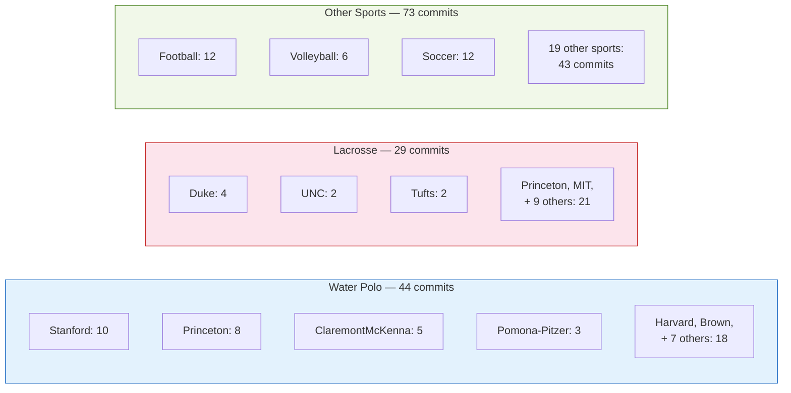
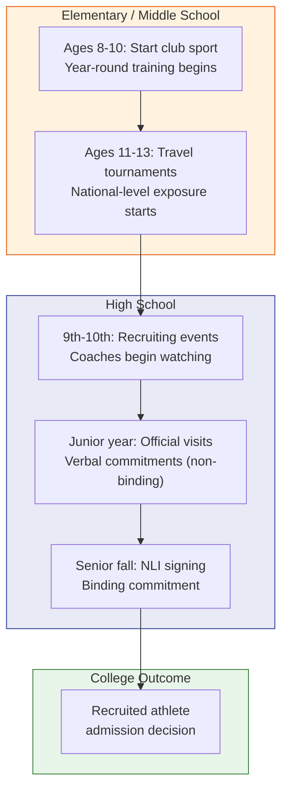
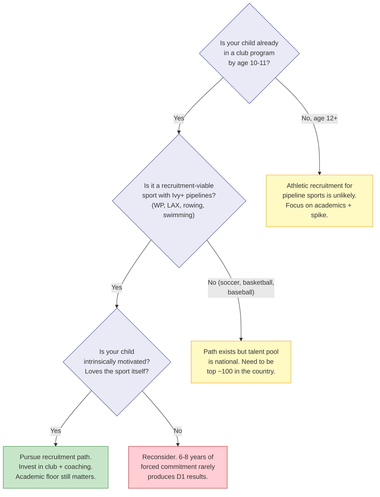

# Chapter 3: The Athlete Hook — Quantified

> **Who this chapter is for:** T1-T2 readers — parents who have read Chapter 1's headline vs. reality gap and want to understand exactly how athletic recruitment shapes placement data. Whether your child is an athlete or not, this chapter changes how you read every school's numbers.

Athletic recruitment is the single largest hidden variable in Bay Area private school college placement data. Chapter 1 showed you that SHP's headline Ivy+ rate of 16.8% drops to 10.5% once you remove recruited athletes. This chapter goes deeper: which sports, which colleges, what the timeline looks like, and whether the athletic recruitment path makes sense for your family.

---

You are at a school fundraiser gala, seated next to a parent whose son just committed to play water polo at Princeton. "He's been playing since third grade," she says. "Club team, travel tournaments, the whole thing." You nod politely. Your daughter is in sixth grade, plays soccer recreationally, and gets straight A's. You drove here thinking about your school's 17% Ivy+ rate. You are now doing math in your head, and the math is not comforting.

Here is the thing the fundraiser parent will not tell you, because she may not know it herself: her son is not an outlier in the data. He is the data. At SHP, water polo alone accounts for 22 of 50 athlete-to-Ivy+ placements over five years. Her son is one of roughly four water polo players per year who commit to an Ivy+ school from this single campus. Your daughter's soccer — recreational, no club team — is not in the same universe of admissions impact. [A]

That is not a judgment. It is a structural fact about how college recruitment works, and it should change how you interpret your school's numbers.

---

## The SHP Athlete Pipeline: Five Years of Data

SHP publishes named athlete commitment lists every year — a level of transparency almost no other Bay Area private school offers. Over five graduating classes (2021-2025), 146 athletes committed to play college sports. Fifty of those went to Ivy+ schools. [A]

Here is the year-by-year breakdown:

| Year | Class Size | Total Athletes | Athletes to Ivy+ | WP to Ivy+ | LAX to Ivy+ | Other to Ivy+ | Total Ivy+ | Non-Athlete Ivy+ | Non-Athlete Rate |
|------|-----------|----------------|-------------------|------------|-------------|---------------|-----------|-----------------|-----------------|
| 2021 | 155 | 23 | 3 | 1 | 2 | 0 | 28 | 25 | 16.1% |
| 2022 | 155 | 40 | 20 | 12 | 5 | 3 | 25 | 5 | 3.2% |
| 2023 | 171 | 31 | 8 | 3 | 1 | 4 | 28 | 20 | 11.7% |
| 2024 | 149 | 29 | 12 | 3 | 4 | 5 | 30 | 17 | 11.4% |
| 2025 | 160 | 23 | 6 | 3 | 1 | 2 | 22 | 16 | 10.0% |
| **Total** | **790** | **146** | **50** | **22** | **13** | **14** | **133** | **83** | **10.5%** |

Two sports dominate this pipeline: water polo and lacrosse. Together, they account for 35 of 50 athlete-to-Ivy+ placements — 70% of the athlete hook at SHP. [A]

The 2022 class is the extreme case worth studying. That year, 40 athletes committed to play in college — nearly twice the typical year. Twenty went to Ivy+ schools. Of those twenty, twelve were water polo players (seven to Stanford, four to Princeton, one to Brown) and five were lacrosse players (three to Duke, one to Stanford, one to Penn). The non-athlete Ivy+ enrollment that year was five students out of 155 — a 3.2% rate. [A]

If you were a non-athlete family in SHP's class of 2022, your school's headline Ivy+ rate was 16.1%. Your child's realistic rate was 3.2%. That is a fivefold gap, and it was entirely invisible on the placement page.

---

## Which Sports Feed Which Colleges

Not all sports are created equal in the recruitment pipeline. Here is where SHP athletes actually go:

**Figure 3.1:** SHP five-year athlete commits by sport group. Water polo and lacrosse together produced 73 of 146 total commits — exactly half — but accounted for 70% of all athlete-to-Ivy+ placements.

### Water Polo: The Dominant Pipeline

Water polo is SHP's signature athletic pipeline. Over five years, 44 students committed to play water polo in college — more than any other sport. Twenty-two of them went to Ivy+ schools. [A]

The destinations are concentrated:

| College | WP Commits | Years Active |
|---------|-----------|-------------|
| Stanford | 10 | 2022 (7), 2023 (1), 2025 (2) |
| Princeton | 8 | 2021 (1), 2022 (4), 2023 (1), 2024 (1), 2025 (1) |
| Harvard | 2 | 2023 (1), 2024 (1) |
| Brown | 2 | 2022 (1), 2025 (1) |

Stanford and Princeton alone absorbed 18 of 22 Ivy+ water polo commits. This is not random — Stanford and Princeton have two of the strongest collegiate water polo programs in the country. SHP, located twenty minutes from Stanford's campus, has direct coaching and club connections to these programs. [D]

Here is what makes water polo unusual as a recruitment sport: the talent pool is shallow. Water polo is not widely played outside California, parts of the Midwest, and a handful of East Coast programs. A strong water polo player from the Peninsula has far less competition for recruitment slots than a strong soccer or basketball player competing against a national talent pool. Coaches consistently report that this is why water polo converts to elite college placements at a rate no mainstream sport can match. [D]

### Lacrosse: The East Coast Connection

Lacrosse is SHP's second major pipeline. Twenty-nine athletes committed over five years, thirteen to Ivy+ schools. [A]

| College | LAX Commits | Years Active |
|---------|-----------|-------------|
| Duke | 4 | 2022 (3), 2024 (1) |
| Princeton | 2 | 2021 (1), 2023 (1) |
| MIT | 2 | 2024 (1), 2025 (1) |
| Harvard | 1 | 2024 |
| Brown | 1 | 2024 |
| Stanford | 1 | 2022 |
| Georgetown | 1 | 2021 |
| Penn | 1 | 2022 |

Duke is the primary lacrosse destination — four commits in five years, all to a top-5 program. But lacrosse also scatters across the Ivy League and elite schools in a way water polo does not: Harvard, Brown, MIT, Georgetown, Penn, Princeton. This reflects lacrosse's broader institutional presence on the East Coast. [A]

Lacrosse has grown rapidly on the Peninsula over the past decade. Like water polo, it occupies a strategic niche: competitive enough to drive recruitment, but still newer to California — meaning less competition for roster spots than in traditional East Coast strongholds. [D]

### Everything Else: Scattered Impact

The remaining 73 athlete commits spread across 20+ sports — football (12), soccer (12), volleyball (6), baseball (6), basketball (5), swimming (3), rowing (2), and various others. Of these, only 14 went to Ivy+ schools, scattered across Brown, Harvard, Yale, Penn, MIT, Duke, Northwestern, and Cornell. [A]

No single "other" sport produced more than two Ivy+ commits over five years. Football sent two to Harvard and Brown. Rowing sent two to Yale and Penn. Swimming sent two to Brown and Harvard. These are real pathways, but they are not pipelines — they are individual cases, not repeatable patterns.

A micro-case. A family we'll call the Andersons have a son who is a strong varsity swimmer at an SHP-type school. He made CCS (Central Coast Section) finals. The Andersons have been told by a club coach that "D1 is definitely in play." Over five years at SHP, exactly three swimmers committed to play in college — two to Ivy+ schools (Brown and Harvard). Swimming can work as a recruitment hook. But the pipeline is thin enough that each case is essentially sui generis. The Andersons should pursue it with open eyes, not with the assumption that swimming has the same structural advantage as water polo at their school.

---

## How Athletic Recruitment Actually Works

If you are a non-athlete family, you can skip this section. If you are considering the athletic recruitment path, this is the timeline you need to understand.

**Figure 3.2:** The athletic recruitment timeline from initial sport commitment through NLI signing. The process typically spans 6-8 years, with meaningful commitment beginning in elementary school.

### The timeline, compressed

**Ages 8-10:** Club sport begins — not school rec league, but competitive club. For water polo on the Peninsula, this means programs like Stanford Water Polo Club or 680 Aquatics. For lacrosse, Bay Area club programs. Year-round training. This is the commitment gate: if a family is not here by age 10, the recruitment path for pipeline sports becomes significantly harder. [D]

**Ages 11-13:** Travel tournaments begin. College coaches attend these events to identify talent early. For water polo, Junior Olympics and US Water Polo events are key showcases. This is where coaches first notice a player. [D]

**9th-10th grade:** College coaches reach out (NCAA rules restrict timing — verify current regulations at ncaa.org). Unofficial campus visits happen. Academic credentials start to matter: coaches want players who will clear admissions. [A/D]

**Junior year:** Official campus visits. Verbal commitments — non-binding agreements where a player commits to a school. In practice, verbal commitments are honored the vast majority of the time. This is when the admissions advantage locks in. [D]

**Senior fall:** The National Letter of Intent (NLI) is signed during NCAA-designated signing periods. At Ivy League schools, the NLI is not used — instead, the school provides a "likely letter" and the athlete signs a financial agreement. The practical effect is the same: a reserved spot. [A]

### What "recruited" means for admissions

Recruited athletes do not go through the same admissions process as other applicants. At most selective colleges, the athletic department provides the admissions office with a list of recruits — often called a "coach's list" or "tip list." These applicants receive a significant admissions advantage. At Harvard, litigation in the SFFA case revealed that recruited athletes were admitted at rates exceeding 80%, compared to roughly 5% for the general applicant pool. Other Ivy League schools operate similarly. [A]

This is not a minor edge. It is a parallel admissions channel with fundamentally different acceptance rates. When you see that SHP sent 10 water polo players to Stanford over five years, those players were not competing against the 3.7% general admission rate. They were on the coach's list, reviewed in a process where the vast majority of listed athletes are admitted. [A/E]

---

## Why Other Schools Don't Publish This Data

SHP is unusual. Most Bay Area private schools do not publish athlete commitment lists. There is no conspiracy here — schools simply have no incentive to decompose their headline numbers. A school that reports "22% of graduates attend Ivy+ schools" looks better than one that reports "14% of non-athlete graduates attend Ivy+ schools," even though the second number is more useful to most families. [E]

### How to estimate the athlete share at any school

1. **Check the school's athletics page.** Schools with strong pipelines feature signing ceremonies and "college commitment" photos. Count them. [E]

2. **Look for sport-specific strength signals.** Does the school win CCS or NCS championships in specific sports? Championship programs produce D1 recruits. [D]

3. **Cross-reference recruiting databases.** NCSA and similar sites sometimes list commits by high school. Incomplete but directional. [E]

4. **Ask directly.** "Of your Ivy+ placements last year, how many were recruited athletes?" Most admissions offices have never been asked. [E]

5. **Apply a rough heuristic.** At Bay Area private schools with strong athletics, estimate 25-40% of Ivy+ placements involve recruited athletes. At schools with dominant water polo, lacrosse, or rowing, the share may be higher. At academically-focused schools (Nueva, Crystal Springs), near zero. [E]

---

## The "Soft Athlete" Path

Not every athlete is recruited. Many students play varsity sports, earn All-League honors, even compete at CCS — and are never on a college coach's radar. What is varsity participation worth in admissions without the recruitment hook?

A micro-case. A family we'll call the Raos have a daughter who is a varsity tennis player. She is the number two singles player on her school's team. She made the second round of CCS. She also has a 4.2 GPA and strong test scores. The Raos have been told by a private counselor that her tennis "will look great on the application." They want to know: how much does it actually help?

The honest answer: it helps, but not in the way recruitment helps. Varsity athletics demonstrates commitment, time management, and physical discipline. Admissions officers consistently report valuing these qualities. But a non-recruited varsity athlete is in the general applicant pool, competing at the 4-7% admit rate, not on the coach's list at 80%+. [D/E]

The difference is not one of degree. It is one of kind. A recruited athlete has a reserved seat. A varsity athlete has a small plus factor on an application that will be evaluated holistically. The tennis player's sport may be the difference between "admit" and "waitlist" in a close call — but it will not transform a borderline application into a lock. [E]

Many families invest heavily in a sport through high school believing varsity status provides significant admissions leverage. For recruitment-level athletes, it does. For the rest, the impact is real but modest — comparable to strong commitment in any other extracurricular domain. [D/E]

---

## What This Chapter Is Not Saying

This chapter is not saying athletic recruitment is unfair. Recruited athletes have trained for years, often since elementary school, at significant family cost in time and money. They earned their spots.

This chapter is not saying your child should play water polo. Starting a sport for the purpose of college recruitment, particularly after age 10, is generally too late for the pipeline sports that produce Ivy+ commits. Coaches consistently say they can identify players who started for strategic reasons — the commitment gap shows up in performance and dedication. [D]

This chapter is not saying non-athlete families are disadvantaged. SHP's non-athlete Ivy+ rate of 10.5% is strong. It means roughly one in ten non-recruited graduates enrolls at a top university. That rate competes favorably with the most competitive public high schools in the Bay Area.

What this chapter is saying: **the athlete hook is a structural feature of college placement data, not an anomaly. Understanding it lets you read every school's numbers accurately — and make decisions based on what is real for your family, not what the composite average suggests.**

---

## Should Your Family Pursue Athletic Recruitment?

This is a decision framework, not a recommendation. Honest answers to these questions will tell you whether the recruitment path is realistic.

**Is your child already on the path?** If your child is 12 or older and not already training year-round in a club program for a recruitment-viable sport, the window for pipeline sports (water polo, lacrosse, rowing) is closing or closed. Other sports have different timelines — golf and tennis recruitment can start later — but the high-volume Ivy+ pipelines favor early starters. [D]

**Is it the right sport?** Water polo and lacrosse produce outsized Ivy+ results at Peninsula schools because the collegiate talent pool is small and the local club infrastructure is strong. Soccer, basketball, and baseball have much larger national talent pools — a strong Bay Area player may not be nationally competitive. Swimming and track are individually meritocratic (times don't lie), which makes the path clearer but no easier. [D/E]

**Can your family sustain the commitment?** Club sports on the Peninsula cost $5,000-$15,000 per year in fees alone, plus travel, equipment, and time. The commitment is year-round. For water polo, this means pool time five to six days per week, plus weekend tournaments. For lacrosse, fall ball, indoor winter league, and spring season create a nearly continuous calendar. Families who start this path should understand it as a 6-8 year commitment, not a 2-year experiment. [D]

**Is your child intrinsically motivated?** Coaches and admissions officers both report that the most successful recruited athletes are those who play because they love the sport, not because their parents identified a strategic pathway. This is not soft advice — it is practical. The commitment required to reach recruitment level is intense enough that externally motivated athletes typically drop out or plateau before the payoff arrives. [D]

**Figure 3.3:** Decision framework for evaluating the athletic recruitment path. Most families arrive at one of the yellow boxes — which is not a failure. It is useful information that redirects energy toward strategies with higher expected value.

---

## Quick Reference

| Question | Answer | Source |
|----------|--------|--------|
| What share of SHP's Ivy+ placements are athletes? | 50 of 133 (37.6%) over 5 years | SHP athlete + placement data [A] |
| Which sports dominate the Ivy+ pipeline? | Water polo (22) and lacrosse (13) = 70% of athlete-to-Ivy+ | SHP athlete commits [A] |
| Where do water polo recruits go? | Stanford (10), Princeton (8), Harvard (2), Brown (2) | SHP athlete commits [A] |
| Where do lacrosse recruits go? | Duke (4), Princeton (2), MIT (2), Harvard (1), Brown (1) | SHP athlete commits [A] |
| What is the non-athlete Ivy+ rate at SHP? | 10.5% (83 of 790 over 5 years) | Calculated from SHP data [A/E] |
| Worst single year for non-athletes? | 2022: 3.2% (5 of 155) — 20 of 25 Ivy+ were athletes | SHP data [A] |
| When does the recruitment pipeline start? | Club sport by ages 8-10; serious travel by 11-13 | Coach and parent reports [D] |
| What is varsity participation worth without recruitment? | Small positive factor in holistic review — not a reserved seat | Admissions officer consensus [D] |
| How to estimate athlete share at other schools? | Check signing ceremonies, CCS titles, ask directly. Estimate 25-40% at sports-strong schools. | Author synthesis [E] |

---

## Chapter Evidence Note

This chapter relies primarily on **Tier A** (official school data) and **Tier D** (community patterns) evidence, with **Tier E** (author synthesis) for interpretive framing.

**Tier A claims:** SHP athlete commitment lists (names, sports, colleges) for classes 2021-2025; SHP college placement data (enrolled counts by year); class sizes from school profile PDFs; NCAA NLI signing period dates; Harvard SFFA litigation data on recruited athlete admit rates — all from official publications and court records.

**Tier D claims:** Recruitment timeline norms (when club sports start, when coaches begin watching); water polo talent pool dynamics (shallow national pool favoring California players); lacrosse growth trajectory on the Peninsula; club sport cost ranges ($5,000-$15,000/year); coach and admissions officer reports on intrinsic motivation and "soft athlete" admissions impact — these are consistent community patterns, not controlled studies.

**Tier E claims:** The 25-40% athlete share heuristic for non-publishing schools; the characterization of varsity participation as "small plus factor"; the decision framework for evaluating the recruitment path; the recommendation to ask schools directly about athlete share — these are author synthesis based on the data and community patterns above.

*All SHP data in this chapter is from official school publications covering graduating classes 2021-2025. Recruitment timelines and cost estimates reflect 2024-2025 Bay Area norms. NCAA contact rules change periodically — verify current regulations at ncaa.org before acting on specific timeline claims.*
