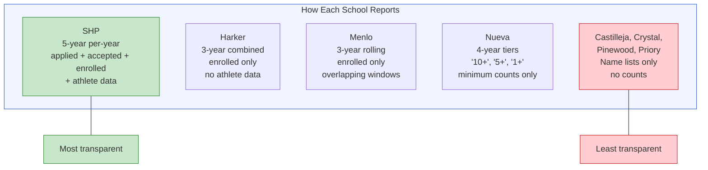
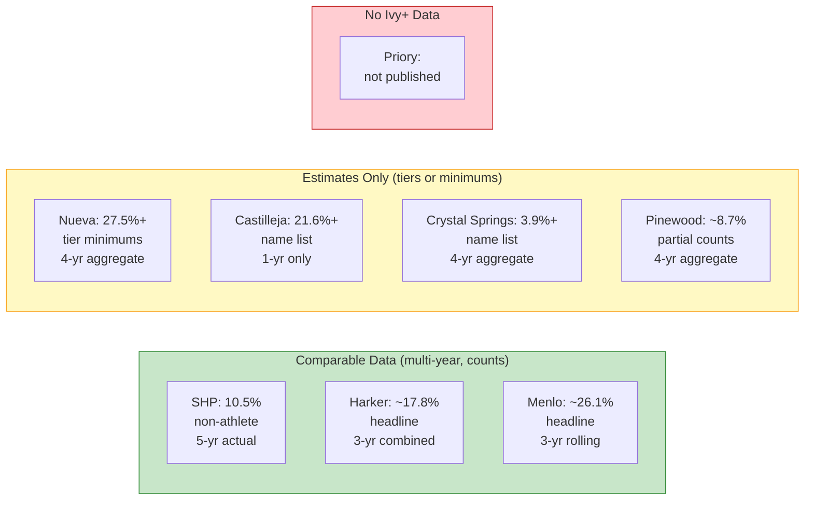
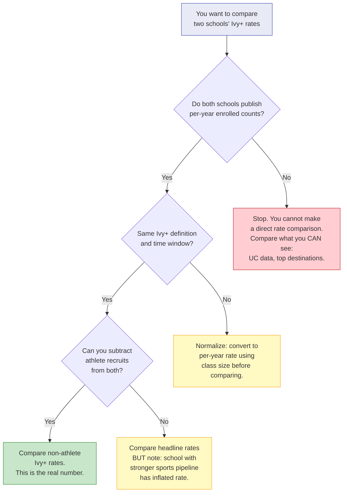

# Chapter 4: School by School — The Real Numbers

> **Who this chapter is for:** T2 readers — parents already at or seriously considering one of these schools, who want standardized, honest data for comparison. You should read Chapters 1-3 first.

Every school in this chapter publishes college placement data. None of them publish it the same way. One gives you five years of applied-accepted-enrolled counts by college. Another gives you a three-year aggregate with no per-year breakdown. A third gives you four-year tiers — "10 or more," "5 or more," "1 or more" — that tell you a school sent at least ten students to Harvard over four years without telling you if that means ten or forty. This chapter standardizes what they publish so you can compare them. Where the data won't support comparison, we say that clearly. [E]

---

You are standing at a school fair in downtown Palo Alto, and four schools have booths within fifty feet of each other. Each one has a poster with college logos. Each one looks impressive. You cannot tell, from the posters, which school sends the most students to Ivy+ colleges, because each poster uses different counting rules, different timeframes, and different definitions of what counts. By the end of this chapter, you will know what each school's data actually says — and what it carefully does not say.

---

## How to Read This Chapter

Each school profile follows the same structure:

1. **What they publish** — the format, timeframe, and metric (enrolled vs. accepted vs. "attended")
2. **Ivy+ numbers** — standardized to the best available data window
3. **Top destinations** — where graduates actually go (not just the prestige names)
4. **UC admissions** — from UC InfoCenter, which is standardized across schools [A]
5. **Data quality notes** — what you should and shouldn't conclude from this school's data

Ivy+ means the eight Ivies plus Stanford, MIT, Caltech, Duke, UChicago, Northwestern, and Johns Hopkins — fifteen schools total. This definition is the same across every profile. [E]

---

## The Private Schools

### Sacred Heart Preparatory (SHP) — Atherton

**What they publish:** Five years of per-college data (2021-2025) with applied, accepted, and enrolled counts. Also publishes annual athlete commitment lists. This is the gold standard of data transparency among Bay Area private schools. [A]

| Metric | Value |
|--------|-------|
| Class size | 149-171 (5-yr range); avg 158 |
| Data window | 5 years (2021-2025), per-year |
| Ivy+ enrolled (5-yr total) | 124 |
| Ivy+ rate (headline) | 15.7% avg |
| Athletes to Ivy+ (5-yr) | ~50 |
| Non-athlete Ivy+ rate | ~10.5% |

**Top destinations (5-yr enrolled):** Santa Clara (35), Stanford (28), UC Berkeley (22), Cal Poly SLO (22), UCLA (20), USC (19), Notre Dame (18), TCU (17), SMU (17). [A]

**UC admissions (2024):** 86 applied, 53 admitted (62% admit rate). Asian applicants: 23 applied, 16 admitted (70%). White applicants: 36 applied, 19 admitted (53%). [A]

**Data quality:** Excellent. SHP is the only school where you can decompose athlete vs. non-athlete placements and track year-over-year volatility. The non-athlete Ivy+ rate ranged from 3.2% (2022) to 16.1% (2021) — a massive swing driven by athletic cohort composition. If you use SHP as your benchmark, use the five-year non-athlete average (10.5%), not any single year. [E]

---

### The Harker School — San Jose

**What they publish:** Three-year combined enrollment list (Classes of 2023-2025) with counts per college. No per-year breakdown. No applied or accepted data. No athlete data. [A]

| Metric | Value |
|--------|-------|
| Class size | ~260 (estimated from UC applicant data) |
| Data window | 3 years combined (2023-2025) |
| Ivy+ enrolled (3-yr total) | 139 |
| Ivy+ rate (estimated) | ~17.8% per year |
| Athlete data | Not published |

**Top destinations (3-yr enrolled):** Stanford (34), Carnegie Mellon (27), UC Berkeley (26), NYU (26), Purdue (25), UCLA (17), UChicago (16), Santa Clara (16), Columbia (15), UT Austin (15). [A]

**UC admissions (2024):** 187 applied, 132 admitted (71% admit rate). Asian applicants: 120 applied, 81 admitted (68%). White applicants: 23 applied, 18 admitted (78%). [A]

**Data quality:** Moderate. The three-year combined window hides year-to-year volatility entirely. You cannot tell if Stanford took 15 students one year and 5 the next, or a steady 11 per year. Without athlete data, the Ivy+ rate cannot be decomposed. Harker's UC applicant pool is 64% Asian — the highest of any school in this chapter — which means internal competition dynamics from Chapter 5 are strongest here. The estimated class size (~260) makes Harker's 17.8% headline Ivy+ rate look comparable to SHP's 15.7%, but without athlete decomposition, the true non-athlete rate is unknown. [E]

A micro-case. A family we'll call the Sharmas are comparing Harker and SHP. On paper, Harker's Ivy+ rate (17.8%) beats SHP's (15.7%). But Harker has nearly twice SHP's class size, meaning the raw number of Ivy+ admits is higher while the rate is only modestly different. The Sharmas — engineers, both — want to know the non-athlete rate at Harker. Nobody can tell them. The data does not exist in public form. What the Sharmas can see: Harker sends 34 students to Stanford in three years (11.3/year) from a class of ~260. SHP sends 28 in five years (5.6/year) from a class of ~158. Per-student, the Stanford rates are 4.3% (Harker) vs. 3.5% (SHP). Close enough that the school choice should be driven by other factors. [E]

---

### Menlo School — Atherton

**What they publish:** Three-year rolling aggregates. The current profile shows Classes of 2023-2025 enrolled. Prior profiles showed 2021-2023 and 2020-2022, creating overlapping windows. No per-year breakdown. No athlete data. [A]

| Metric | Value |
|--------|-------|
| Class size | 143-146 |
| Data window | 3-yr rolling (most recent: 2023-2025) |
| Ivy+ enrolled (3-yr, 2023-2025) | 112 |
| Ivy+ rate (estimated) | ~26.1% per year |
| National Merit Semifinalists | 5-12 per year |
| Athlete data | Not published |

**Top destinations (3-yr, 2023-2025 enrolled):** Stanford (30), UChicago (17), Northwestern (10), Cornell (9), Dartmouth (8), Harvard (7), Duke (7). [A]

**UC admissions (2024):** 115 applied, 68 admitted (59% admit rate). Asian applicants: 36 applied, 25 admitted (69%). White applicants: 36 applied, 20 admitted (56%). [A]

**Data quality:** Needs careful interpretation. Menlo's 26.1% headline Ivy+ rate is the highest of any school in this chapter. But the overlapping three-year windows mean you cannot isolate individual years or track trends. The rate may also reflect athletic recruitment — Menlo has strong lacrosse and water polo programs — but no public athlete data exists to verify. Stanford is Menlo's dominant destination: 30 students over three years, or 10 per year from a class of ~143. That is a 7% Stanford enrollment rate, the highest of any school profiled. [E]

The overlapping window issue is worth understanding. Menlo's 2021-2023 window shows 23 Stanford enrollees. The 2023-2025 window shows 30. These windows share the Class of 2023, so you cannot simply add them. A parent who sees "23 Stanford" on one profile and "30 Stanford" on the next might think placements surged. They may have — or the overlap may make the change look larger than it is. [E]

---

**Figure 4.1:** Data transparency varies dramatically across Bay Area private schools. SHP publishes the most granular data; several schools publish only name lists without counts.

---

### Castilleja School — Palo Alto

**What they publish:** A list of colleges where recent graduates "matriculated," with bold formatting to indicate enrollment. One year's data (Class of 2025). No counts per college. [A]

| Metric | Value |
|--------|-------|
| Class size | 51 |
| Data window | 1 year (2025) |
| Ivy+ enrolled (confirmed minimum) | 11 (at least 1 each to 11 Ivy+ schools) |
| Ivy+ rate (minimum estimate) | ~21.6% (could be higher) |
| Mean GPA (weighted) | 4.14 |
| College-going rate (4-yr) | 97% |

**Top destinations:** Cannot determine — no counts published. The list includes Harvard, Princeton, Yale, Stanford, Brown, Cornell, Dartmouth, Duke, Northwestern, UPenn, UChicago. [A]

**UC admissions (2024):** 47 applied, 25 admitted (53% admit rate). Asian applicants: 23 applied, 10 admitted (43%). White applicants: 9 applied, 5 admitted (56%). [A]

**Data quality:** Limited. With a class of 51, Castilleja is the second-smallest school profiled. At least 11 Ivy+ schools appear on the 2025 list, but without counts, the minimum (11 students to 11 schools) and maximum (potentially more per school) are unknown. Small class sizes amplify volatility — two or three exceptional students in a class of 51 can move the Ivy+ rate by 4-6 percentage points. The UC admit rate (53%) is the lowest of any private school profiled, driven partly by a notably low Asian admit rate (43%). [E]

---

### The Nueva School — San Mateo

**What they publish:** Four-year aggregate placement data in tiers: "10 or more," "5 or more," "1 or more." Two overlapping windows: Classes 2020-2023 and Classes 2021-2024. [A]

| Metric | Value |
|--------|-------|
| Class size | 108-112 |
| Data window | 4-yr tiers (most recent: 2021-2024) |
| Ivy+ enrolled (4-yr, minimum estimate) | ~121 |
| Ivy+ rate (estimated from tier minimums) | Not reliably calculable |
| Mean SAT | 1510 |
| Mean ACT | 33-34 |
| National Merit Semifinalists | 19-25 per year |

**What the tiers actually tell you (2021-2024 window):** [A]

| Tier | Colleges in Ivy+ list |
|------|----------------------|
| 10 or more (4-yr) | Harvard, Stanford, Princeton, Columbia, Cornell, Brown, UPenn, Northwestern, UChicago |
| 5 or more (4-yr) | MIT, Yale, Caltech, Duke, Dartmouth |
| 1 or more (4-yr) | JHU |

**UC admissions (2024):** 98 applied, 63 admitted (64% admit rate). Asian applicants: 40 applied, 30 admitted (75%). White applicants: 31 applied, 19 admitted (61%). [A]

**Data quality:** Frustrating. Nueva has some of the strongest test scores and National Merit numbers of any school profiled. But the tier system makes precise comparison impossible. "10 or more to Harvard over four years" could mean 10 or 40. The tier minimums sum to 121 Ivy+ placements over four years from classes averaging 110, which would imply a 27.5% annual rate — but the actual number could be significantly higher. Nueva's refusal to publish exact counts, despite clearly having strong placement, is itself informative: it likely reflects a philosophical choice about not defining the school by college placement. [E]

---

### Crystal Springs Uplands School — Hillsborough

**What they publish:** A four-year aggregate list (Classes 2022-2025) of colleges where graduates enrolled. No counts — just confirmed minimums of 1 per college. [A]

| Metric | Value |
|--------|-------|
| Class size | 90 |
| Data window | 4-yr (2022-2025), name list only |
| Ivy+ enrolled (confirmed minimum) | 14 (at least 1 each to 14 of 15 Ivy+ schools) |
| Ivy+ rate (minimum estimate) | ~3.9% per year (could be much higher) |

**UC admissions (2024):** 66 applied, 42 admitted (64% admit rate). Asian applicants: 39 applied, 27 admitted (69%). White applicants: 11 applied, 4 admitted (36%). [A]

**Data quality:** Very limited. The name list confirms Crystal Springs placed at least one graduate at 14 of 15 Ivy+ schools over four years. That is breadth. But without counts, you cannot determine depth. The school might have sent 5 students to Stanford over four years or 20. The UC data is more revealing: 66 applications from a class of 90 means 73% of Crystal Springs students apply to UCs. The Asian share of UC applicants has grown from 44% (2020) to 59% (2024), a significant demographic shift worth watching. [E]

---

### Pinewood School — Los Altos Hills

**What they publish:** Four-year aggregate (Classes 2022-2025) with two tiers: 2+ graduates confirmed (marked with asterisk) and minimum 1 confirmed. [A]

| Metric | Value |
|--------|-------|
| Class size | 44-54 (varies significantly) |
| Data window | 4-yr (2022-2025) |
| Ivy+ enrolled (confirmed minimum) | 17 |
| AP courses | 17 |
| National Merit Semifinalists | 2-4 per year |
| College-going rate (4-yr) | 100% |

**UC admissions (2024):** 26 applied, 19 admitted (73% admit rate). Asian applicants: 18 applied, 14 admitted (78%). [A]

**Data quality:** Limited by class size. Pinewood's graduating classes range from 44 to 54 students — the smallest in this chapter. The 17 confirmed Ivy+ placements over four years (~4.25/year) from a class averaging ~49 suggests a rate around 8.7%, but the margins of error on a class this small are enormous. One student more or less changes the rate by 2 percentage points. The UC data is the most reliable indicator: a 73% UC admit rate is strong, and the 78% Asian admit rate is the highest of any school profiled. [E]

---

### Woodside Priory School — Portola Valley

**What they publish:** No standardized placement data was found in public sources. [A]

| Metric | Value |
|--------|-------|
| Class size | ~45-55 (estimated from UC applicant data) |
| Data window | None publicly standardized |
| Ivy+ data | Not available in public record |

**UC admissions (2024):** 40 applied, 27 admitted (68% admit rate). Asian applicants: 9 applied, 4 admitted (44%). White applicants: 10 applied, 4 admitted (40%). [A]

**Data quality:** Minimal. Woodside Priory is the only school in this chapter with no publicly available Ivy+ placement data in any standardized form. The UC data suggests a small school with modest UC applicant volume. Without placement data, no Ivy+ analysis is possible. [E]

---

## The Comparison Table

This is the table every parent wants. It is also the table most likely to mislead, because the data behind each row comes from different timeframes, formats, and counting methods. Read the footnotes before drawing conclusions.

**Figure 4.2:** Ivy+ rate comparability across Bay Area private schools. Only three schools publish enough data for even approximate rate calculations; two more provide tier-based estimates; two offer only name lists.

| School | Class Size | Ivy+ Rate | Data Window | Data Quality | Top Destination |
|--------|-----------|-----------|-------------|--------------|-----------------|
| **SHP** | 158 avg | 10.5% (non-ath) / 15.7% (all) | 5-yr per-year | Excellent | Stanford (28) |
| **Harker** | ~260 | ~17.8% (no decomp) | 3-yr combined | Moderate | Stanford (34) |
| **Menlo** | ~143 | ~26.1% (no decomp) | 3-yr rolling | Moderate | Stanford (30) |
| **Nueva** | ~110 | 27.5%+ (tier min) | 4-yr tiers | Low (tiers) | Stanford (10+) |
| **Castilleja** | 51 | 21.6%+ (min) | 1-yr list | Low (no counts) | Multiple (1+ each) |
| **Crystal Springs** | 90 | 3.9%+ (min) | 4-yr list | Very low | Unknown |
| **Pinewood** | ~49 | ~8.7% | 4-yr partial | Low | Stanford (2+) |
| **Priory** | ~50 | N/A | None | None | Unknown |

**Critical caveat:** Only SHP's rate is decomposed into athlete and non-athlete. Every other school's headline rate includes recruited athletes. If Menlo or Harker have athletic recruitment pipelines comparable to SHP's, their non-athlete rates could be 4-6 percentage points lower than the headlines suggest. [E]

---

## The Public Schools

Three public high schools are included for comparison. Their data comes from different sources: user-collected spreadsheets (cross-validated where possible) and UC InfoCenter. [A/D]

### Gunn High School — Palo Alto

| Metric | Value |
|--------|-------|
| Class size | 447 |
| Ivy+ enrolled (approx annual) | 149 |
| Ivy+ rate | ~33.3% |
| Top Ivy+ destinations | Stanford (48), Cornell (13), MIT (11), UChicago (11), UPenn (11), Brown (10) |
| UC Berkeley enrolled (annual) | ~75 |

### Palo Alto High School (Paly) — Palo Alto

| Metric | Value |
|--------|-------|
| Class size | 476 |
| Ivy+ enrolled (approx annual) | 100 |
| Ivy+ rate | ~21.0% |
| Top Ivy+ destinations | Stanford (23), UChicago (13), Brown (10), Northwestern (10), Cornell (7) |
| UC Berkeley enrolled (annual) | ~49 |

### Lynbrook High School — San Jose

| Metric | Value |
|--------|-------|
| Class size | 472 |
| Ivy+ enrolled (approx annual) | 74 |
| Ivy+ rate | ~15.7% |
| Top Ivy+ destinations | Cornell (12), Stanford (11), UPenn (11), MIT (10), JHU (7) |
| UC Berkeley enrolled (annual) | ~56 |

**Data quality note for all three public schools:** These numbers come from user-collected data (described as approximately 2021-2023 three-year averages, rounded). They have not been verified against official school publications. Treat them as directional estimates, not precise figures. The public school numbers appear to use a similar Ivy+ definition but may include different counting conventions. [D]

---

## The ROI Question

A micro-case. A family we'll call the Garcias have a daughter in fourth grade. She is a strong student at a public elementary school in Palo Alto. The Garcias are weighing whether to apply to Menlo or Harker for sixth grade entry, or stay in the Palo Alto district and attend Gunn. The tuition question is $50,000 per year for seven years (grades 6-12), or approximately $350,000 total. [E]

Here is what the placement data suggests:

| Path | Ivy+ Rate (headline) | Annual Cost | 7-Year Cost | Ivy+ Rate per $100K |
|------|---------------------|-------------|-------------|---------------------|
| Gunn (public) | ~33.3% | $0 | $0 | N/A — free |
| Menlo (private) | ~26.1% | ~$55,000 | ~$385,000 | ~6.8% |
| Harker (private) | ~17.8% | ~$55,000 | ~$385,000 | ~4.6% |
| SHP (private, non-athlete) | ~10.5% | ~$55,000 | ~$385,000 | ~2.7% |

On a pure placement-rate basis, Gunn — a free public school — has a higher headline Ivy+ rate than any private school profiled. [A/D/E]

This table is deliberately provocative, and it is also deliberately incomplete. Chapter 6 explains why the ROI calculation is more nuanced than "higher rate, lower cost = better." The answer depends on what the private school premium actually buys — and for whom. [E]

---

## What This Chapter Is Not Saying

This chapter is not saying some schools are better than others. A school's Ivy+ rate does not capture the quality of its teaching, the health of its community, or the happiness of its students.

This chapter is not saying low-data schools are hiding bad results. Small schools (Castilleja, Pinewood, Priory) may choose not to publish counts precisely because their small class sizes make individual students identifiable. That is a privacy decision, not an evasion.

This chapter is not saying the public school numbers are directly comparable to the private school numbers. The data sources, collection methods, and student populations are different enough that the comparison table should be read as directional, not as a controlled experiment.

What this chapter is saying: **the data landscape is uneven, and the unevenness itself is data.** Schools that publish more tell you more. Schools that publish less leave you guessing. When you are spending $50,000 per year, you should know how much guessing you are doing. [E]

---

**Figure 4.3:** Decision tree for comparing any two schools' placement data. Most comparisons fail at the first or second gate because schools do not publish data in compatible formats.

---

## Quick Reference

| What you want to know | Where to look | What to watch for |
|-----------------------|---------------|-------------------|
| Ivy+ rate for SHP | This chapter — 10.5% non-athlete (5-yr) | Best-documented school; use non-athlete rate |
| Ivy+ rate for Harker | This chapter — ~17.8% headline (3-yr) | No athlete decomposition; includes athletic recruits |
| Ivy+ rate for Menlo | This chapter — ~26.1% headline (3-yr) | Overlapping windows; no athlete data; highest headline rate |
| Ivy+ rate for Nueva | This chapter — 27.5%+ (tier minimums) | Tiers give floors, not actuals; could be much higher |
| Ivy+ rate for Castilleja | This chapter — 21.6%+ (1-yr minimum) | Tiny class (51); one year only; high volatility |
| Ivy+ rate for small schools | This chapter — limited | Crystal Springs, Pinewood, Priory: minimal count data |
| Public school comparison | This chapter — Gunn 33.3%, Paly 21.0%, Lynbrook 15.7% | User-collected data; different methodology; directional only |
| UC admissions by ethnicity | UC InfoCenter (free, searchable) | Standardized and reliable; best cross-school comparison tool |
| Athlete impact on rates | Ch. 3 for SHP details; unknown at other schools | If no athlete data, assume headline rate is inflated |

---

## Chapter Evidence Note

This chapter relies primarily on **Tier A** (official school data and UC InfoCenter) and **Tier E** (author synthesis) evidence, with some **Tier D** (user-collected public school data).

**Tier A claims:** Class sizes, Ivy+ enrolled counts (where published), UC admissions data by school and ethnicity, GPA and test score data from school profiles — all from official school publications or UC InfoCenter. Source URLs are in the database.

**Tier D claims:** Public school Ivy+ enrollment numbers (Gunn, Paly, Lynbrook) are from user-collected spreadsheets described as three-year averages, approximately 2021-2023, rounded. These have not been verified against official school publications and should be treated as directional estimates.

**Tier E claims:** Rate calculations, cross-school comparisons, the ROI table, data quality assessments, and the interpretation that data transparency varies systematically across schools — all author synthesis. The comparison table carries particular E-tier risk because it compares numbers from incompatible data sources.

*Before making decisions based on specific numbers, verify with current school publications. Ivy+ definitions may vary. Public school data should be cross-validated with school-published college placement pages where available.*
