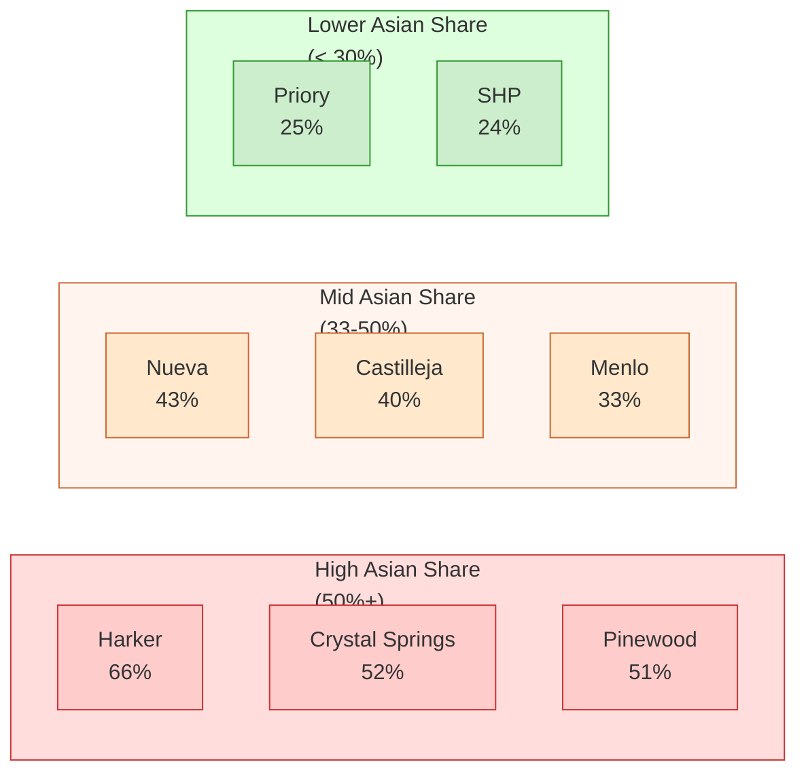
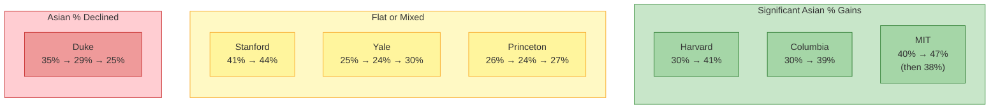
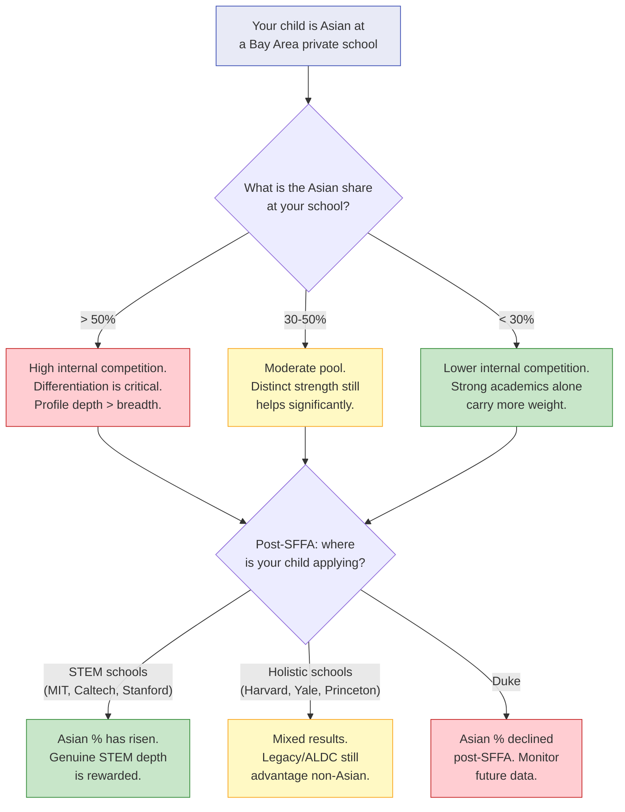

# Chapter 5: The Asian Parent Reality

> **Who this chapter is for:** T2 readers — committed parents who have already decided on private school and need to understand how demographic composition shapes college admissions outcomes. Many readers of this chapter will be Asian American. This chapter is written for them, not about them.

The demographic composition of your child's school determines the internal competition pool. Post-SFFA, the race-based ceiling has been removed but replaced with socioeconomic proxies that disadvantage affluent Bay Area private school families of all races — and Asian families disproportionately. Understanding this structure is the first step toward making it work for you.

---

You are at the Harker School open house in San Jose, a Sunday morning in October. Your daughter is in third grade. The facilities are spectacular — a new STEM wing, gleaming labs, a campus that looks like a small college. The admissions director is giving the pitch: top college placements, rigorous academics, world-class faculty. You are impressed. Then you walk into the student center, and you notice something. About two-thirds of the families around you look like yours. Chinese, Indian, Korean, Vietnamese. You scan the room. It is not a vague impression. It is a demographic fact.

Later that night, you pull up the UC InfoCenter — the University of California's public admissions database, which reports applicants by high school and ethnicity. You type in Harker. The number comes back: 120 Asian students applied to UC schools from Harker in 2024, out of 187 total. That is 64%. You type in Sacred Heart Preparatory. Twenty-three Asian applicants out of 86. That is 27%.

Two schools. Both on the Peninsula. Both charging north of $50,000 a year. But the competition landscape inside each school is radically different — and that difference will follow your daughter through every college application she files.

---

## The Demographic Map

The UC InfoCenter is the only public data source that reports college applicants by high school and ethnicity. It is official UC data — not estimates, not surveys, not school self-reports. Every number below comes from this source. [A]

Here is what the Asian share of UC applicants looks like across all eight private schools in our dataset, averaged over five years (2020-2024):

| School | Avg Asian UC Applicants | Avg Total UC Applicants | Asian Share |
|--------|------------------------|------------------------|-------------|
| Harker | 120 | 182 | 66% |
| Pinewood | 14 | 28 | 51% |
| Crystal Springs | 31 | 59 | 52% |
| Nueva | 34 | 79 | 43% |
| Castilleja | 16 | 41 | 40% |
| Menlo | 31 | 95 | 33% |
| Woodside Priory | 11 | 44 | 25% |
| Sacred Heart Prep | 21 | 86 | 24% |

The range is enormous. Harker's student body is nearly two-thirds Asian. Sacred Heart's is less than one-quarter. Priory is similar to Sacred Heart. Menlo sits in the middle third. Crystal Springs and Pinewood are majority-Asian. [A]

These numbers measure UC applicants, not enrolled students, but for Bay Area private schools with near-100% college application rates, UC applicant data is a reliable proxy for overall class composition. [E]

**Figure 5.1:** Asian share of UC applicants across eight Bay Area private schools (2020-2024 average), grouped into three tiers. UC InfoCenter data.

---

## What "Internal Competition" Actually Means

A number — 66% or 24% — does not mean much on its own. What matters is what it implies for your child's college application.

College admissions offices read applications in context. They know which high school you come from. They know its demographic profile. When an admissions reader at Stanford picks up an application from Harker, they are reading it alongside every other Harker application — and mentally noting that two-thirds of Harker's graduating class is Asian. When they pick up an application from Sacred Heart, the context is different: roughly one-quarter Asian. [E]

Here is the concrete math for 2024. Harker sent 120 Asian students applying to UC schools. Sacred Heart sent 23. Both schools produce strong students. But a college admissions office evaluating Harker applicants is looking at five times as many Asian applicants with similar profiles — similar GPAs, similar test scores, similar extracurricular patterns — from a single school. [A]

This is not about quotas. It is about differentiation. Admissions officers at selective schools are building a class. They want diversity of perspective, background, and profile within each incoming cohort. When 120 applicants from one school share a similar demographic and academic profile, standing out requires more than being excellent. It requires being distinctly excellent in a way that the other 119 are not. [E]

Consider a micro-case. A family we'll call the Raos have twin sons at Harker — strong students, both in robotics and math team, both play piano. At their school, they are surrounded by peers with nearly identical profiles: Asian, STEM-strong, musically trained, high-achieving. When their applications reach Stanford or MIT, they arrive alongside dozens of similar applications from the same school. The Raos' twins are excellent. They are also, from an admissions reader's perspective, not unusual.

Now consider the same twins at Menlo, where Asian students make up 33% of UC applicants. They are still excellent. But in Menlo's context, they are part of a smaller cohort with their profile. They stand out more — not because they are better, but because the background contrast is different. The admissions reader has fewer "compare-to" applications from the same school.

This is not a theory. It is the structural logic that admissions consultants describe when they talk about "school context" — the documented practice where admissions offices evaluate applicants relative to their high school peers, not just against the national pool. [C]

---

## The Post-SFFA Landscape

In June 2023, the Supreme Court ruled in SFFA v. Harvard that race-conscious admissions at selective universities was unconstitutional. For Asian American families, this was supposed to be the decision that removed the ceiling. The reality is more complicated. [A]

### Who Gained, Who Didn't

Two admissions cycles have now completed under race-neutral policies. The data from the Classes of 2028 and 2029 tells a split story:

| School | Pre-SFFA Asian % | Class of 2028 | Class of 2029 | Net Change |
|--------|-----------------|---------------|---------------|------------|
| Harvard | 30% | 37% | 41% | +11 pp |
| MIT | 40% | 47% | 38% | -2 to +7 pp |
| Columbia | 30% | 39% | — | +9 pp |
| Stanford | ~41% | 41% | 44% | +3 pp |
| Yale | 25% | 24% | 30% | +5 pp |
| Princeton | 26% | 24% | 27% | +1 pp |
| Duke | 35% | 29% | 25% | -10 pp |

Sources: Harvard Crimson, MIT's The Tech, Columbia Spectator, Stanford Daily, Yale Daily News, Daily Princetonian, Duke Chronicle — all L2. [C]

**Figure 5.2:** Post-SFFA Asian enrollment changes at seven elite universities, grouped by outcome. Two-year data (Classes of 2028 and 2029). Data from campus newspapers.

The pattern is not random. STEM-heavy institutions (MIT, Caltech) saw the largest initial gains — consistent with the fact that their applicant pools were already disproportionately Asian, and removing race as a factor let the underlying pool composition flow through. Holistic admissions schools (Harvard, Yale, Princeton) showed smaller or mixed results. Duke is an outlier: Asian enrollment dropped significantly in both post-SFFA cycles, which triggered a legal threat from SFFA itself. [C]

Two important caveats. First, MIT's swing from 47% to 38% in a single year shows how much normal statistical noise exists — a 9-point swing that likely reflects applicant pool variation, not policy change. Researchers had predicted the average national gain for Asian Americans from SFFA would be less than 2 percentage points. The school-level data is noisier than the national average. Second, multiple universities changed their racial classification methodology (adopting IPEDS standards) at the same time they implemented race-neutral admissions, making direct year-over-year comparisons less reliable than they appear. [C]

### The Stanford Legacy Ban

One structural change matters more for Bay Area families than any SFFA data point: California's AB 1780, signed by Governor Newsom in September 2024, bans legacy and donor preferences at all California private nonprofit universities — including Stanford — effective for students entering fall 2026. [A]

This is not a symbolic gesture. Research from the Harvard SFFA trial showed legacy applicants were admitted at 5.7 times the rate of comparable non-legacies. At Harvard, Yale, and Princeton, approximately 43% of white admits had ALDC status (athlete, legacy, dean's list, children of faculty) versus roughly 15% of Asian admits. Legacy preferences were, structurally, one of the largest remaining advantages for white applicants over Asian applicants at these schools. [C]

Stanford is the most important college destination for Bay Area private school families. Removing legacy there is a concrete, measurable, structural positive for Asian applicants who rarely benefit from legacy connections at a school founded in 1891. Harvard, Yale, Princeton, and Duke retain legacy preferences — at those schools, the old dynamics persist. [E]

---

## The Socioeconomic Proxy Problem

Here is the part that gets less attention. After SFFA banned race-conscious admissions, selective universities pivoted to socioeconomic proxies for diversity. These include first-generation college status, Pell Grant eligibility, neighborhood housing data, single-parent household status, and geographic underrepresentation. Some institutions use algorithmic models that combine factors statistically correlated with race — like neighborhood housing turnover and criminal-justice involvement rates — to identify applicants from underrepresented communities without directly asking about race. [C]

These proxies are legal. They are also structurally irrelevant to your family.

If you are an Asian parent paying $55,000 a year in tuition at Harker or Menlo or Crystal Springs, your child is, by definition, not first-generation, not Pell-eligible, and not from an underrepresented ZIP code. The socioeconomic diversity machinery provides exactly zero boost. This is true regardless of race — a white family at these schools gets no socioeconomic boost either. But it falls disproportionately on Asian families because Asian families are overrepresented at expensive Bay Area private schools. At Harker, where 66% of UC applicants are Asian, the socioeconomic proxy effectively filters against two-thirds of the student body. [E]

Consider a second micro-case. A family we'll call the Wangs came to the U.S. from Shanghai fifteen years ago. Both parents have PhDs from Berkeley. Their daughter attends Crystal Springs Uplands. They are first-generation immigrants — they were the first in their families to come to America. But they are not "first-generation college students" by the admissions definition, which means first in the family to attend college at all. Their income puts them well above Pell eligibility. Their ZIP code in Hillsborough is one of the wealthiest in the country. Every socioeconomic proxy reads them as privileged. The fact that the father grew up in a rural village in Anhui province and was the first in his village to attend university — that context does not register in the proxy system.

The Wangs are not unusual. This profile — immigrant family, educated parents, high income, first-generation in the American sense but not in the admissions-office sense — is extremely common at Bay Area private schools. The post-SFFA socioeconomic framework was designed to maintain diversity after race was removed as a direct factor. For families like the Wangs, it creates a structural gap: neither the old race-based system nor the new socioeconomic system works in their favor. [E]

---

## What Asian Parents Can Actually Control

The structural dynamics above are real, and you cannot change them. What you can change is how you position within them.

**School choice is a demographic strategy.** This is not the only reason to choose a school — pedagogy, culture, commute, and community matter. But pretending demographics don't affect admissions outcomes is willful blindness. At Harker, your Asian child is one of 120 Asian UC applicants. At Sacred Heart, they are one of 23. The academic programs at both schools are strong. The internal competition landscape is structurally different. If you are in the early stages of school selection (K-5), this is one of the most consequential variables you can influence. [E]

**Build a profile that breaks the pattern.** Admissions officers at selective schools have described the "typical Harker applicant" in industry discussions: Asian, STEM-strong, math competition medals, piano or violin, robotics team. There is nothing wrong with this profile. It is a profile shared by dozens of applicants from the same school. Differentiation means depth in an unexpected direction — a competitive debater, a published short-story writer, a student who started a community organization in a non-STEM domain. The goal is not to hide who your child is. It is to show a dimension that the admissions reader does not see in the next thirty applications from the same school. [E]

**The STEM-strong Asian female intersection.** In STEM fields at elite universities, women remain underrepresented. An Asian female applicant with genuine strength in math, physics, or computer science occupies a specific intersection: overrepresented by race, underrepresented by gender within the discipline. Admissions consultants who work with Bay Area families consistently report that this intersection is one of the few where the demographic dynamics work favorably for Asian applicants — particularly at engineering-focused programs at MIT, Caltech, and Stanford. This is a community observation, not a guarantee, and it reflects current conditions that may shift as female STEM participation grows. [D]

Consider a third micro-case. A family we'll call the Lees have a daughter in sixth grade at Harker who loves math and is qualifying for MATHCOUNTS state. The Lees assumed they were at a disadvantage — "everyone says being Asian is bad for admissions." After understanding the structural dynamics, they see it differently. Their daughter's profile (Asian, female, genuinely strong in competitive math) is actually distinctive at the intersection level, even if "Asian math student" is common at the category level. They also learn that the school-context effect means differentiation within Harker's applicant pool matters more than differentiation in the abstract. The Lees start thinking about how to deepen the math strength with research or mentorship, rather than broadening into more generic extracurriculars.

---

## What This Chapter Is Not Saying

This chapter is not saying being Asian is a disadvantage in college admissions. The post-SFFA data shows Asian enrollment rising at most elite schools. The structural ceiling that existed under race-conscious admissions has been removed. The picture is more nuanced than the simple narrative in either direction.

This chapter is not saying you should choose a school based only on demographics. A school where your child thrives academically and socially is more valuable than demographic positioning. But ignoring demographics is like buying a house without checking the school district — you can do it, but you are leaving a major variable unexamined.

This chapter is not saying the system is fair or unfair. It is showing what the data says. The socioeconomic proxy system disadvantages affluent families of all races. Legacy preferences advantage families with multigenerational ties to specific institutions, which skews heavily white. The SFFA ruling removed one barrier and left others intact. Whether this net result is just depends on your values. What it means for your strategy depends on the data.

This chapter is not saying Asian students cannot get into top schools. They can and do — in large numbers. The question this chapter addresses is different: given the specific structure of Bay Area private school demographics, what does an Asian parent need to understand to make informed decisions? The answer is that school context, internal competition, and post-SFFA proxy systems are structural factors that shape outcomes in ways the brochure never mentions.

---

## What This Means for Your Family

The emotional narrative around being Asian in college admissions runs hot — anxiety in every WeChat parent group, dire predictions at every dinner party. The structural reality is colder and more specific.

**The race-based ceiling is gone.** Harvard's Asian enrollment went from 30% to 41% in two years. This is real. If your child is applying to most elite schools after SFFA, they face less explicit racial balancing than applicants in 2022 did. This is a meaningful positive.

**The socioeconomic floor was added.** The new proxy-based diversity system provides no advantage to affluent private school families. This is a new structural factor that did not exist pre-SFFA, and it works against high-income Bay Area applicants regardless of race.

**School context is the variable you control.** Your child's demographic profile within their school matters more than their demographic profile nationally. At a school where 66% of applicants look like your kid, differentiation is harder. At a school where 24% do, it is easier. This is not a reason to transfer — but it is a reason to understand what you are working with.

**Legacy is eroding.** Stanford's legacy ban is permanent and structural. If other states follow California's lead, the largest remaining non-merit advantage in admissions will shrink. For Asian families without multigenerational Ivy connections, this is a tailwind.

**Your child's application year is 2038.** The legal landscape is actively contested. SFFA is threatening more schools. The Trump administration is pressuring universities on diversity essays. Additional state-level legacy bans are possible. No one can tell you what the rules will be in twelve years. What you can do is build genuine depth and distinction — which is the one strategy that works under every possible regulatory regime. [E]

---

## Quick Reference

| Factor | What the Data Shows | What It Means for You |
|--------|--------------------|-----------------------|
| Asian share varies 24-66% by school | Harker 66%, Crystal Springs 52%, Menlo 33%, SHP 24% (UC InfoCenter 2020-2024) | Your school choice determines how many similar-profile applicants your child competes against internally |
| Post-SFFA Asian % rose at most schools | Harvard 30→41%, MIT 40→47→38%, Stanford 41→44% | The race-based ceiling is gone; this is a structural positive |
| Duke Asian % declined | 35%→29%→25% across two post-SFFA cycles | Not all schools moved in the same direction; school-level variation is large |
| Socioeconomic proxies replaced race | First-gen, Pell-eligible, geographic diversity now weighted | Provides zero boost to affluent Bay Area private school families |
| Stanford legacy ban (AB 1780) | Effective for students entering fall 2026+ | Removes one of the largest structural advantages that disproportionately benefited non-Asian families |
| Legacy persists at Harvard/Yale/Princeton/Duke | 11-14% of class; 5.7x admit rate advantage | The biggest remaining non-merit factor at these schools still does not help most Asian families |
| STEM-strong Asian female | Underrepresented at the intersection of gender and discipline | One of the few profiles where demographic dynamics work favorably for Asian applicants |

**Figure 5.3:** Decision framework for Asian families at Bay Area private schools. Start with your school's demographic composition, then consider where your child will apply.

---

## Chapter Evidence Note

This chapter relies primarily on **Tier A** (official UC data), **Tier C** (institutional/journalistic reports), and **Tier E** (author synthesis) evidence.

**Tier A claims:** Asian share of UC applicants by school (Harker 66%, Crystal Springs 52%, Menlo 33%, SHP 24%, etc.) — from UC InfoCenter public data, 2020-2024. California AB 1780 (legacy ban) signed September 2024 — from Governor's office press release. These are verified official sources.

**Tier C claims:** Post-SFFA Asian enrollment percentages at Harvard, MIT, Columbia, Stanford, Yale, Princeton, and Duke — from campus newspapers (Harvard Crimson, The Tech, Columbia Spectator, Stanford Daily, Yale Daily News, Daily Princetonian, Duke Chronicle). Legacy admit rate advantage (5.7x) and ALDC composition (43% of white admits) — from SFFA v. Harvard trial record. Socioeconomic proxy strategies — from Inside Higher Ed, City Journal, and academic analyses.

**Tier D claims:** STEM-strong Asian female as a favorable intersection — from admissions consultant community consensus, not controlled studies.

**Tier E claims:** The interpretation that school demographic composition determines "internal competition," the framing of socioeconomic proxies as disadvantaging affluent Bay Area families specifically, the strategic advice on profile differentiation, and the overall synthesis connecting demographic data to admissions strategy — these are author judgment based on the Tier A and Tier C evidence above.

*Before making school-choice or admissions-strategy decisions based on specific percentages, verify current data at the UC InfoCenter (ucinfocenter.universityofcalifornia.edu) and relevant university admissions pages. Post-SFFA policies and demographic trends are changing rapidly; the data in this chapter covers Classes of 2028-2029 and may not reflect conditions at the time your child applies.*
