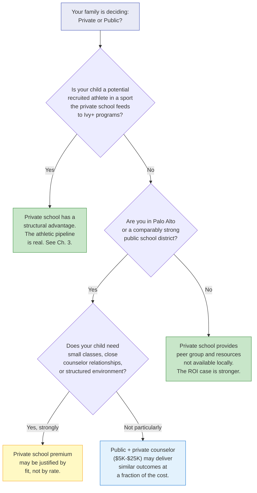
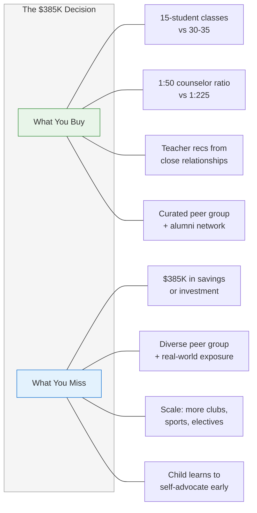

# Chapter 6: Private vs Public — Is It Worth It?

> **Who this chapter is for:** T1/T2 readers — parents at any stage who are weighing whether $50,000/year in private school tuition is justified by college placement outcomes. This is the chapter you read before writing the check or deciding not to.

The spine thesis of this book is that headline placement numbers hide critical structure. This chapter applies that principle to the question Bay Area parents lose the most sleep over: does private school actually improve your child's college outcomes enough to justify the cost? The answer is not yes or no. It is: it depends on which school, which child, and what you mean by "worth it." [E]

---

You are sitting across from your spouse at your kitchen island. Your daughter is in second grade. She is doing well — reading above grade level, enjoys math, has friends. You live in a strong public school district. You also live in a region where half the parents at her school are sending their kids to private middle school applications. The question is not whether your daughter is good enough for private school. The question is whether private school is good enough for your $385,000.

That is the number. Seven years (grades 6-12) at approximately $55,000 per year, after tuition increases. Before you spend it, you want to know what you are buying. This chapter tells you what the data shows — and what it cannot show.

---

## The Headline Numbers: Private vs. Public

Here are the Ivy+ enrollment rates from Chapter 4, side by side:

| School | Type | Class Size | Ivy+ Rate | Annual Tuition | Data Quality |
|--------|------|-----------|-----------|----------------|--------------|
| Gunn | Public | 447 | ~33.3% | $0 | D (user-collected) |
| Paly | Public | 476 | ~21.0% | $0 | D (user-collected) |
| Menlo | Private | ~143 | ~26.1% | ~$55K | A (3-yr rolling) |
| Castilleja | Private | 51 | 21.6%+ | ~$55K | A (1-yr, no counts) |
| Harker | Private | ~260 | ~17.8% | ~$55K | A (3-yr combined) |
| Lynbrook | Public | 472 | ~15.7% | $0 | D (user-collected) |
| SHP (non-athlete) | Private | ~158 | ~10.5% | ~$55K | A (5-yr, decomposed) |

If you stopped reading here, the conclusion would be absurd: Gunn, a free public school, has the highest Ivy+ rate of any school listed. Multiple private schools trail multiple public schools. Why would anyone pay $55,000 per year for a lower placement rate?

The answer is that this table, as presented, is incomplete in ways that change the conclusion. But it is also not wrong. And the ways it is incomplete are themselves instructive. [E]

---

## Why the Raw Numbers Are Misleading (In Both Directions)

### Problem 1: The public school data is less reliable

The Gunn, Paly, and Lynbrook numbers come from user-collected spreadsheets — three-year averages, approximately 2021-2023, rounded. They have not been verified against official school publications. The private school numbers come from school-published documents (school profile PDFs, websites) and are generally more reliable. [D/A]

This matters. If the public school numbers are inflated by even a few percentage points — possible with user-collected data — the gap narrows or reverses. But the gap might also be accurate. We do not know, because public schools in California are not required to publish standardized college placement data. [E]

### Problem 2: Class composition is not equivalent

Gunn and Paly draw from one of the wealthiest, most educated ZIP codes in America. The median household income in Palo Alto exceeds $200,000. Most parents have graduate degrees. The baseline academic preparation, test prep access, college counseling investment (private counselors are common), and cultural expectation of elite college attendance is already extremely high. [D]

Gunn's 33.3% Ivy+ rate does not mean "a typical public school sends a third of its graduates to Ivy+ colleges." It means "a public school in one of the most educationally privileged communities in the country sends a third of its graduates to Ivy+ colleges." Comparing Gunn to a private school is comparing two highly selected populations. [E]

### Problem 3: Athlete decomposition is missing everywhere except SHP

SHP's non-athlete Ivy+ rate is 10.5%. Its headline rate is 15.7%. The 5.2 percentage-point gap is entirely recruited athletes. No other school — public or private — publishes this decomposition. [A/E]

Private schools with strong athletic programs (SHP, Menlo, possibly Harker) likely have inflated headline rates. But public schools also have athletes who are recruited to Ivy+ colleges. Gunn and Paly have competitive water polo, swimming, and tennis programs. The athlete share of their Ivy+ numbers is unknown but nonzero. [E]

The honest answer: **on the data available, we cannot make a clean private-vs-public comparison.** What we can do is identify what private schools provide beyond placement rates, and let you assess which of those factors matter for your family. [E]

---

```mermaid
flowchart TD
    subgraph Private["What $55K/Year Buys"]
        direction TB
        A["College Counseling<br/>2-3 dedicated counselors<br/>for 140-260 seniors"]
        B["Teacher Recommendations<br/>Small classes → teachers<br/>know students deeply"]
        C["Course Selection<br/>17+ AP courses<br/>+ non-AP advanced options"]
        D["Peer Group<br/>Pre-selected for<br/>academic motivation"]
        E["Network Effects<br/>Alumni connections<br/>parent networks"]
    end
    subgraph Public["What $0/Year Provides"]
        direction TB
        F["College Counseling<br/>1-2 counselors<br/>for 450+ seniors"]
        G["Teacher Recommendations<br/>Larger classes → must<br/>actively build relationships"]
        H["Course Selection<br/>Broad AP catalog<br/>+ community college options"]
        I["Peer Group<br/>Diverse academic range<br/>self-selection into honors"]
        J["Scale Advantages<br/>More clubs, sports,<br/>extracurricular variety"]
    end

    style Private fill:#e8f5e9,stroke:#388e3c
    style Public fill:#e3f2fd,stroke:#1976d2
```

**Figure 6.1:** The private school premium is not primarily about academics — it is about counseling ratio, recommendation letter quality, and peer group curation. The public school advantage is scale, diversity, and cost.

---

## What Private Schools Actually Provide

### 1. Counseling Ratio

This is the most concrete advantage. At Menlo, two to three college counselors serve approximately 143 seniors — a ratio of roughly 1:50. At Harker, the ratio is similar. At Gunn, one or two counselors serve 447 seniors — a ratio of roughly 1:225. [A/D]

What does a 1:50 ratio buy you? A counselor who knows your child's name, story, and academic trajectory before junior year. Who can write a detailed institutional recommendation letter that speaks to specific accomplishments. Who can make strategic calls about Early Decision targets, which schools are likely "fits" versus "reaches," and how to sequence the application list. [D]

At 1:225, the counselor can provide logistics support — deadlines, transcript processing, basic list-building — but cannot know each student individually unless the student actively seeks them out. Most Paly and Gunn families supplement with private college counselors, at $5,000-$25,000 per engagement. [D]

A micro-case. A family we'll call the Tanakas have a son at Gunn. He is a strong student — 4.3 weighted GPA, 1540 SAT, co-captain of the debate team. The Tanakas hired a private college counselor for $12,000. The counselor helped with school list, essay strategy, and application positioning. Their son got into Northwestern ED. The Tanakas estimate the private counselor provided roughly what a private school counselor would have provided as part of tuition — but at a fraction of the cost. The other $43,000/year in private school tuition buys other things: smaller classes, different peer group, different extracurricular access. Whether those things mattered more than seven years of savings — that is a values question, not a data question. [D/E]

### 2. Recommendation Letters

Private school teachers have smaller classes (12-18 students vs. 28-35 at public schools) and see the same students across multiple years in a smaller community. The resulting recommendation letters tend to be more specific, more personal, and more detailed. [D]

Admissions officers have told counselors — and counselors consistently report — that recommendation letters from well-known private schools carry implicit institutional credibility. A letter from a Menlo teacher or a Harker counselor arrives with context: the admissions office knows the school's rigor, grading standards, and student caliber. A letter from Gunn carries similar weight — Gunn is equally well-known to admissions offices — but the teacher at Gunn has 180 students and the teacher at Menlo has 60. The Menlo letter is likelier to include the kind of specific anecdote that admissions readers remember. [D]

### 3. Peer Group and Culture

The hardest thing to quantify and possibly the most important. Private schools select for families who prioritize education and can afford to pay for it. The resulting peer group is academically motivated by default. At Gunn and Paly, the honors and AP tracks create a similar peer group — but the student body as a whole spans a wider range. [E]

For some students, the wider range is an advantage: exposure to different backgrounds, interests, and socioeconomic realities. For others, the curated environment of a private school reduces distraction and normalizes high achievement. Neither is universally better. Both are real. [E]

### 4. Course Selection

Pinewood offers 17 AP courses. Nueva offers none (by design — they use their own advanced curriculum). Harker offers a broad AP catalog plus research opportunities. Gunn and Paly also offer extensive AP options and have the additional advantage of concurrent enrollment at Foothill College. [A]

The private school course advantage is not in the number of AP classes available — public schools match or exceed many private schools on that dimension. It is in the non-AP advanced options (independent research, college-level courses on campus, specialized seminars) and in class sizes small enough that every student gets substantive feedback. [D/E]

---

## The Cost-Per-Ivy+-Admit Calculation

This is the number every parent calculates in their head, even if they know it is reductive. Let's make it explicit.

| School | Ivy+ Rate | Ivy+ Admits/Year | Cost (6-12) | Cost per Ivy+ Admit |
|--------|-----------|------------------|-------------|---------------------|
| Gunn | ~33.3% | ~149 | $0 | $0 |
| Paly | ~21.0% | ~100 | $0 | $0 |
| Menlo | ~26.1% | ~37/yr | ~$385K | ~$10.4K per % point |
| Harker | ~17.8% | ~46/yr | ~$385K | ~$21.6K per % point |
| SHP (non-ath) | ~10.5% | ~17/yr | ~$385K | ~$36.7K per % point |
| Lynbrook | ~15.7% | ~74 | $0 | $0 |

Read this table carefully. The "cost per Ivy+ admit" is not what you pay to get your child into an Ivy+ school. It is the total tuition divided by the Ivy+ rate, giving you a rough sense of how much you are paying per percentage point of probability. And even this framing is misleading, because the private school rate includes factors (counseling, letters, peer group) that may causally contribute to placement, while the public school rate reflects community affluence, not school-added value. [E]

The honest calculation: if your child would attend Gunn or Paly without private school, and if the user-collected data is directionally accurate, the placement-rate argument for private school is weak. You are paying $385,000 for a placement rate that may be lower than what you get for free. [E]

But "placement rate" is not the same as "placement probability for your specific child." The child who thrives in a 15-person seminar may underperform in a 35-person lecture. The child who needs close counselor relationships may flounder with a 1:225 ratio. The child who is a recruited athlete at a private school with a strong sports pipeline gets an advantage no public school can replicate. These are individual factors, not population-level statistics. [E]

---

**Figure 6.2:** Decision framework for the private vs. public question. The answer depends on three factors: athletic recruitment potential, local public school quality, and individual child needs.

---

## When Public Is the Better Choice

A micro-case. A family we'll call the Kims have a daughter who is self-motivated, socially confident, and academically strong. She does not need small classes to engage — she seeks out teachers on her own. She has a clear spike interest (computational biology) that she pursues through online courses and a summer internship she arranged herself. The Kims live in Palo Alto. They toured Menlo and Harker and liked both, but their daughter preferred the energy and diversity of Gunn. [D/E]

The Kims' calculation: Gunn's Ivy+ rate (~33.3%) is higher than any private school in the area. Their daughter's profile (self-directed, spike interest, strong test scores) would benefit from private counseling ($15,000) but does not need the full private school wrapper. The $370,000 they save goes into a 529 plan. Their daughter attends Gunn, works with a private counselor starting junior year, and applies to Stanford, MIT, and Princeton. [E]

This is not a hypothetical argument. The Palo Alto public schools produce more Ivy+ enrollees per year in absolute numbers than any single private school in this chapter. Gunn alone sends roughly 149 students to Ivy+ schools annually — more than every private school profiled combined. [D/E]

The public school advantage is strongest when:
- Your local public school is in the top tier (Gunn, Paly, or comparable)
- Your child is self-motivated and does not need close institutional structure
- You are willing to invest in private college counseling separately
- Your child's spike interest does not require specialized resources only private schools offer
- The $350,000+ savings has a meaningful alternative use (529, home down payment, starting a business) [E]

---

## When Private Is the Better Choice

A micro-case. A family we'll call the Mehtas have a son who is bright but needs external structure. In a large classroom, he fades to the middle — not because he cannot do the work, but because he does not assert himself. He had a transformative experience at a summer camp with 10 students per instructor: he led discussions, asked challenging questions, and was visibly more confident. The Mehtas recognize that their son performs best when someone knows him well enough to push him. [D/E]

The Mehtas' calculation: their son's academic potential is high but latent. The 15-student classroom at Menlo, the counselor who will know his name by sophomore year, the teacher who will write a recommendation letter based on three years of close observation — these are not luxuries. For this child, they are the mechanism by which potential becomes performance. The $385,000 is not buying a higher Ivy+ rate. It is buying the environment in which their son is most likely to become the student who earns that rate. [E]

The private school advantage is strongest when:
- Your child needs small classes and close adult relationships to perform at their best
- Your child is a potential recruited athlete in a sport the school feeds to top colleges
- Your local public school is not in the top tier
- The school offers specialized programs (Nueva's design thinking, Harker's STEM research) that align with your child's interests
- You value the peer group curation and community aspects for their own sake, independent of placement outcomes [E]

---

## The Lynbrook-Harker Comparison

This deserves its own section because the comparison is so direct. Lynbrook and Harker are both in San Jose. Both have majority-Asian student bodies. Both are academically intense. And their Ivy+ rates are remarkably close:

| | Lynbrook | Harker |
|-|----------|--------|
| Type | Public | Private |
| Class size | 472 | ~260 |
| Ivy+ rate | ~15.7% | ~17.8% |
| Annual cost | $0 | ~$55,000 |
| 7-year cost | $0 | ~$385,000 |
| Asian share of UC applicants | High (est.) | 64% |

The rate difference is approximately 2 percentage points. Over seven years of tuition, that 2-point premium costs roughly $385,000, or $192,500 per percentage point. [D/E]

A family choosing between Lynbrook and Harker is not choosing between a 15.7% chance and a 17.8% chance. They are choosing between two different educational experiences that happen to produce remarkably similar headline placement outcomes. The reasons to choose Harker over Lynbrook are real — smaller classes, dedicated counseling, STEM research infrastructure, campus facilities — but the placement-rate argument is not one of them. [E]

---

## What This Chapter Is Not Saying

This chapter is not saying private school is a waste of money. The educational experience at a school like Menlo or Harker is genuinely different from Gunn or Lynbrook — different class sizes, different teacher-student ratios, different community feel. Many families value these differences for reasons unrelated to college placement.

This chapter is not saying public school is better. Gunn's high placement rate reflects the community it draws from, not necessarily the school's added value. A student who would thrive at Gunn might struggle at a weaker public school.

This chapter is not saying the data is definitive. The public school numbers are user-collected and unverified. The private school numbers hide athlete decomposition. Neither set of numbers tells you what would happen to your specific child in a different setting.

What this chapter is saying: **the ROI case for private school, measured purely by Ivy+ placement rates, is weaker than most parents assume.** The case for private school is real, but it rests on factors — counseling, relationships, environment, fit — that are harder to quantify than a placement percentage. If you are paying for the number, you may be overpaying. If you are paying for the experience, only you can assess whether it is worth it. [E]

---

## Quick Reference

| Question | Answer | Chapter reference |
|----------|--------|-------------------|
| Does private school have a higher Ivy+ rate than public? | Not consistently. Gunn > every private school. Paly > most. Lynbrook ≈ Harker. | Ch. 4 comparison table |
| What does private school actually provide? | Counseling ratio (1:50 vs 1:225), recommendation quality, peer group, class size | This chapter |
| Can I replicate the private school advantage at public school? | Partially — private counselor ($5-25K) covers the counseling gap | This chapter |
| When is private school clearly worth it? | Recruited athletes, children who need structure, weak local public schools | Decision framework above |
| When is public school clearly the better choice? | Self-motivated child + top-tier public school + willingness to invest in private counseling | Decision framework above |
| What about the $385,000? | Opportunity cost: 529 plan, home equity, financial flexibility | Your family's values |

---

**Figure 6.3:** The private school premium in concrete terms. Both columns are real. The question is which column matters more for your child and your family.

---

## Chapter Evidence Note

This chapter relies primarily on **Tier D** (user-collected public school data, community-reported counseling ratios) and **Tier E** (author synthesis and ROI calculations).

**Tier A claims:** Private school tuition ranges, class sizes, AP course counts, UC admissions data — from official school publications and UC InfoCenter.

**Tier D claims:** Public school Ivy+ enrollment rates (Gunn, Paly, Lynbrook) from user-collected spreadsheets, approximately 2021-2023 averages. Counseling ratios are from community knowledge and school staffing pages, not from controlled studies. College counselor cost ranges are from industry observation.

**Tier E claims:** The ROI calculations, the cost-per-percentage-point analysis, the decision framework, the assessment that Gunn's rate reflects community affluence rather than school-added value, and the judgment that the private school advantage rests more on counseling and environment than on placement rates — all author synthesis. The Lynbrook-Harker comparison is deliberately provocative and relies on the directional accuracy of the user-collected Lynbrook data.

*Before making financial decisions based on these comparisons, verify current tuition rates with school admissions offices and placement rates with current school publications. Public school data should be cross-validated with Naviance or school-published data where available.*
