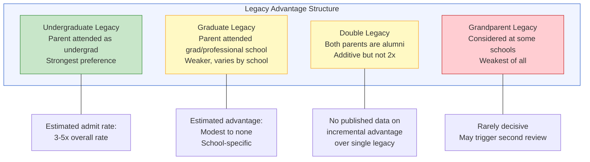
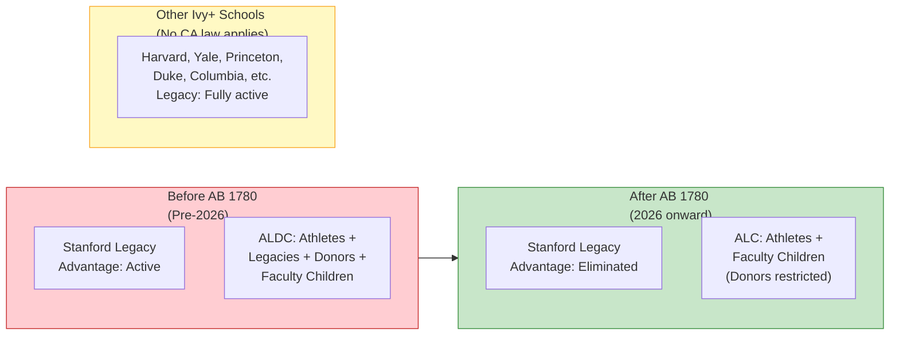
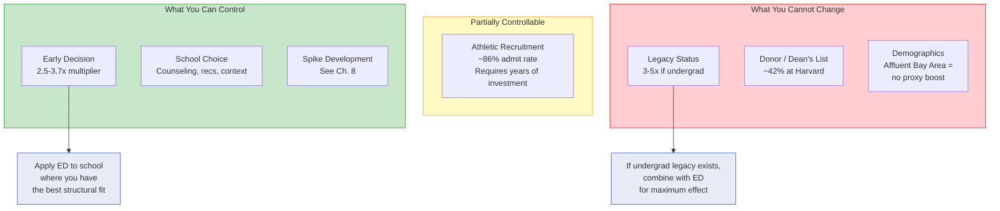

# Chapter 7: Legacy, Early Decision, and Structural Advantages

> **Who this chapter is for:** T2/T3 readers — parents who understand the placement data from earlier chapters and now want to understand the structural mechanisms that actually move admissions outcomes. This chapter goes beyond school-level data into the admissions system itself.

The first six chapters of this book decomposed what schools publish. This chapter looks at what colleges do — the institutional preferences that determine who gets in and why. Legacy. Early Decision. Recruited athletics. Dean's interest lists. These are the structural advantages that operate underneath the placement data. Most parents know they exist. Few understand how large they are, how they interact, and which ones a family can actually use. [E]

---

A family we'll call the Chens — you met them in Chapter 1 — have been doing their homework. They now understand that SHP's headline Ivy+ rate includes athletes, that Menlo's rolling three-year windows obscure trends, and that Gunn's free public school produces comparable or better placement rates. The Chens' daughter is in seventh grade. She is not an athlete. She is an excellent student with a growing interest in neuroscience. The Chens want to know: beyond grades, scores, and extracurriculars, what structural factors actually improve their daughter's chances? What can they influence, and what is baked into the system?

This chapter answers those questions with data. Some of the answers are uncomfortable.

---

## The ALDC Advantage

In 2019, during the SFFA v. Harvard trial, internal Harvard admissions data became public for the first time. The data revealed what admissions consultants had long suspected: four categories of applicants — Athletes, Legacies, Dean's interest list (donors and VIPs), and Children of faculty (ALDC) — received a massive structural advantage. [B]

The numbers, from Harvard's own data: [B]

| Category | Approximate Admit Rate | Compared to Overall (~5%) |
|----------|----------------------|---------------------------|
| Recruited athletes | ~86% | 17x |
| Legacies | ~34% | 7x |
| Dean's interest list | ~42% | 8x |
| Children of faculty | ~47% | 9x |
| Non-ALDC applicants | ~4.7% | Baseline |

Approximately 43% of white admits to Harvard had ALDC status. Approximately 15% of Asian admits did. The structural advantage was not distributed equally across racial groups. [B]

This data is from one school, covering classes admitted in the mid-2010s. But Harvard's admissions process is structurally similar to Yale, Princeton, Stanford, Duke, and other highly selective institutions. Admissions consultants who have worked with multiple elite schools consistently report that ALDC-type advantages exist across the Ivy+ tier, with varying magnitude. [B/D]

The SFFA ruling (June 2023) eliminated race-conscious admissions. It did not touch legacy, athletic, donor, or faculty preferences. These advantages remain fully operational at every Ivy+ school except those that have voluntarily eliminated legacy preferences — a short list. [A/B]

---

## Legacy: What It Actually Means

### The Distinction That Matters: Undergraduate vs. Graduate

Not all legacy is created equal. The critical distinction — one that most parents miss — is between undergraduate legacy and graduate legacy. [C/D]

**Undergraduate legacy:** At least one parent attended the college as an undergraduate. This is "primary legacy" at most schools and carries the strongest preference.

**Graduate legacy:** A parent attended the institution's graduate or professional schools (MBA, MD, JD, PhD) but not as an undergraduate. This is treated very differently across schools. [C]

| School | Undergraduate Legacy | Graduate Legacy | Source |
|--------|---------------------|-----------------|--------|
| Harvard | Strong preference | Weaker; varies | Trial data [B] |
| Yale | Considered | Included in policy | Admissions consulting [C] |
| Stanford | Included — but banned from 2026 (AB 1780) | Same — banned | California law [A] |
| Princeton | Considered | Weaker preference | Admissions consulting [C] |
| Duke | Considered (guaranteed second review) | Policy not publicly defined | Research gap [C/D] |

Duke is a critical case for many Bay Area families. Duke does not publicly state whether graduate degrees count as legacy. Multiple admissions consulting sources indicate graduate-only legacy is materially weaker than undergraduate legacy, but Duke has never confirmed this in public-facing materials. The Duke alumni admissions page refers to services for "alumni whose children or grandchildren are interested in applying" without specifying degree type. [A/C]

**The bottom line for positioning:** If both parents hold Duke MBAs but neither attended Duke as an undergraduate, their child's legacy status at Duke is ambiguous at best. Industry sources estimate the advantage, if any, is modest and not equivalent to primary (undergraduate) legacy. Do not build a strategy around graduate-only legacy as a primary differentiator. [C/E]

---

### Legacy by the Numbers

The NYT/Opportunity Insights study (July 2023) analyzed admissions data across 12 elite colleges, including Duke. Key findings: [B]

- Legacy applicants had a **37% acceptance rate** vs. 9.5% for non-legacy applicants at the same institutions
- Legacy applicants in the **top 0.1% income bracket** were **seven times** more likely to be admitted than applicants with the same test scores
- **17%** of Duke's Class of 2027 survey respondents identified as legacy students

A 2011 study of 30 elite colleges found that "primary legacies" (one or both parents as undergraduate alumni) had a **45.1% increase** in acceptance chances on average. [C]

Legacy at Harvard represents 12-14% of each class. At Yale, approximately 11%. At Princeton, approximately 12%. These percentages have remained remarkably stable despite public pressure to eliminate legacy preferences. [B]

**Figure 7.1:** The hierarchy of legacy preferences. Undergraduate legacy is the strongest; graduate-only legacy is substantially weaker and undefined at some schools (notably Duke).

---

## Early Decision: The Biggest Lever Parents Can Pull

If legacy is the advantage you are born with, Early Decision is the advantage you choose. And the data suggests it may be the single most impactful strategic decision in the application process. [C/E]

### ED vs. RD Rates

| School | ED Admit Rate | Overall Admit Rate | ED Multiplier | Source |
|--------|--------------|-------------------|---------------|--------|
| Duke (Class of 2030) | 13.8% | ~5.2% | 2.7x | Duke Chronicle [A] |
| Duke (Class of 2029) | 12.8% | ~5.2% | 2.5x | Duke Chronicle [A] |

Duke's ED pool typically fills approximately 50% of the incoming class — roughly 847 students out of ~1,740 total. [A]

The ED advantage is not simply a higher admit rate. It reflects three interacting factors: [C/E]

1. **Demonstrated interest.** ED is binding — the student commits to attend if accepted. Schools value this commitment because it improves their yield rate (the percentage of admitted students who enroll), which affects rankings.

2. **Applicant self-selection.** Students who apply ED tend to be stronger applicants who have done their research and identified a clear first-choice school. The pool is, on average, more competitive than the RD pool.

3. **Legacy concentration.** At Duke, 81.7% of legacy applicants applied ED, compared to 54.4% of all applicants (Class of 2025 data). Legacy advantage is concentrated in the ED round. Admissions consultants consistently state: "If a legacy student does not apply early, they give away any advantage they may have had." [C]

A micro-case. A family we'll call the Nguyens — you met them in Chapter 1 — have a daughter who is a strong fit for Duke. She has competitive math credentials, a genuine interest in Duke's biomedical engineering program (#3 nationally), and her father has a Duke MBA. The Nguyens face a strategic choice: apply ED to Duke, locking in the 13.8% admit rate and whatever legacy advantage a graduate degree provides — or apply RD to Duke alongside Stanford, MIT, and Princeton to keep options open. [A/C/E]

The data strongly favors ED. Duke's RD admit rate is approximately 3.7%. ED is 13.8%. That is a 3.7x multiplier. The graduate legacy advantage, if it exists, is most likely to operate in the ED pool where legacy applicants cluster. An RD application from a graduate-only legacy family is, statistically, nearly indistinguishable from a non-legacy application. [C/E]

The cost of ED: the Nguyens cannot compare financial aid offers from multiple schools. If Duke admits their daughter ED, they must attend regardless of the aid package. For families where financial aid is a decisive factor, ED is a constraint. For families where it is not, ED is the strongest strategic lever available. [E]

---

## Stanford's Legacy Ban: AB 1780

On September 30, 2024, California Governor Gavin Newsom signed AB 1780, banning legacy and donor preferences at all California colleges and universities — public and private nonprofit — effective September 1, 2025. [A]

This is the single largest structural change in the admissions landscape for Bay Area families. Stanford, as a California private nonprofit, is now prohibited from considering legacy or donor status in admissions decisions for students entering fall 2026 onward. [A]

What this means in practice:

- **If your family has Stanford legacy:** That advantage no longer exists. Children of Stanford alumni (undergraduate or graduate) receive no preference in admissions starting with the Class of 2030.
- **If your family does NOT have Stanford legacy:** The playing field at Stanford just leveled. Slots previously allocated to legacy admits are now open to the general applicant pool.
- **If you are an Asian American applicant from a Bay Area private school:** This is the most significant structural improvement post-SFFA. Legacy preferences at Stanford historically benefited predominantly white applicants. Removing them opens space for applicants who compete on merit alone. [A/B/E]

The California law does not affect Harvard, Yale, Princeton, Duke, or any other out-of-state school. Legacy preferences remain fully operational at all Ivy League schools and most other elite private universities outside California. [A]

---

**Figure 7.2:** California's AB 1780 eliminated legacy and donor preferences at Stanford (effective 2026). All other Ivy+ schools outside California retain legacy advantages unchanged.

---

## The Post-SFFA Landscape: Who Gained, Who Lost

The June 2023 SFFA v. Harvard ruling eliminated race-conscious admissions. Two years of post-SFFA data now exist. The results are not what most people expected. [B]

### Asian American Enrollment: School by School

| School | Pre-SFFA (Class of 2027) | Class of 2028 | Class of 2029 | Net Change |
|--------|------------------------|---------------|---------------|------------|
| Harvard | ~29.9% | 37% | 41% | +11 pp |
| MIT | ~40% | 47% | 38% | -2 to +7 pp |
| Stanford | ~41% | 41.3% | ~44% | +3 pp |
| Yale | ~24-25% | 24% | 30% | +5-6 pp |
| Princeton | ~26% | 23.8% | 27.1% | +1 pp |
| Duke | ~35% | 29% | 25% | -10 pp |

Sources: Harvard Crimson, The Tech (MIT), Stanford Daily, Yale Daily News, Daily Princetonian, Duke Chronicle — all L2. [B]

The pattern is not linear. MIT surged to 47% Asian in the Class of 2028, then dropped to 38% in the Class of 2029. Yale fell, then recovered. Duke declined across both cycles. Harvard rose steadily. [B]

Pre-SFFA researchers had predicted average gains of less than 2 percentage points for Asian Americans nationally. The actual school-by-school variation far exceeds this — suggesting that normal statistical fluctuation may be as large as any SFFA effect. Two years of data is insufficient for definitive conclusions. [B/E]

### The Compounded Disadvantage for Affluent Bay Area Families

The SFFA ruling removed race as a direct admissions factor. But it did not touch the structural advantages that disproportionately benefit white applicants: legacy, athletic recruitment, and donor preferences. [B]

Meanwhile, schools expanded socioeconomic proxies — first-generation college status, Pell eligibility, neighborhood disadvantage indices — to maintain diversity. These proxies systematically disadvantage affluent applicants of any race. [C]

For Asian American families at Bay Area private schools, the net effect is a compounded structural gap: [E]

1. **No race-based ceiling** (removed by SFFA) — a modest positive
2. **No socioeconomic boost** (affluent families get no proxy advantage) — neutral to negative
3. **Legacy/ALDC preferences continue** (disproportionately benefit white families) — ongoing negative
4. **Geographic diversity push** (Bay Area is overrepresented) — negative
5. **AB 1780** (Stanford legacy eliminated) — a concrete positive at Stanford only

The net calculation: SFFA was a marginal improvement for affluent Asian American families, not the transformation some expected. The largest remaining structural barriers — legacy and athletic recruitment — remain intact everywhere except Stanford. [B/C/E]

---

## What SFFA Threatened but Didn't Touch

SFFA (Students for Fair Admissions) has continued to actively monitor and threaten schools post-ruling:

- **September 2024:** SFFA sent letters to Duke, Princeton, and Yale alleging continued race-consciousness in admissions, using the Asian enrollment drop at Duke (35% to 29%) as evidence. [B]
- **August 2025:** Duke and 31 other colleges were accused of antitrust violations through Early Decision programs (a separate legal theory from race). [B]
- Duke responded to neither allegation publicly. [B]

The legal environment is unsettled. SFFA is pushing for legacy elimination. The Trump administration DOE has pressured schools against using diversity essays as race proxies. Additional state-level legacy bans (following California's lead) are possible. The structural advantages described in this chapter may not be permanent — but they are current. [B/E]

---

## What Parents Can and Cannot Control

**Figure 7.3:** The structural advantages in admissions sorted by family controllability. The strongest lever most families can pull is Early Decision timing; the largest advantages (legacy, donor) are predetermined.

| Factor | Can You Control It? | How Much Does It Matter? | What To Do |
|--------|--------------------|-----------------------------|------------|
| Legacy (undergraduate) | No — you attended or didn't | 3-5x admit rate multiplier | If you have it, use it via ED |
| Legacy (graduate) | No | Modest to none | Don't build strategy around it |
| Early Decision | Yes | 2.5-3.7x multiplier at Duke | Apply ED to top choice if finances allow |
| Recruited athletics | Partially — requires years of investment | ~86% admit rate for Harvard recruits | Only viable if child is genuinely elite in a target sport |
| Donor status | Varies by wealth | Dean's list = ~42% at Harvard | Not actionable for most families |
| Spike / differentiation | Yes | Significant but unquantified | See Chapter 8 |
| School choice | Yes | Affects counseling, recs, context | See Chapter 6 |
| Application timing | Yes | ED >> RD for most schools | Apply ED unless financial aid comparison is essential |

A micro-case. A family we'll call the Patels — you met them in Chapter 1 — have updated their mental model. The father attended IIT Bombay and has a Stanford MBA. The mother has a Columbia undergraduate degree. Their daughter, now in eighth grade, is exploring her application strategy six years in advance. The Patels now understand: the mother's Columbia undergraduate degree gives their daughter primary legacy at Columbia. The father's Stanford MBA gives nothing — AB 1780 eliminated even undergraduate legacy at Stanford. Their best structural play is Columbia ED, where the mother's undergraduate legacy combines with the ED multiplier. RD Columbia, without the ED boost, dissipates most of the legacy advantage. [A/C/E]

---

## What This Chapter Is Not Saying

This chapter is not saying the admissions system is fair. The ALDC advantage is enormous and disproportionately benefits wealthy white families. That is what the data shows.

This chapter is not saying parents should game the system. Understanding structural advantages is not the same as endorsing them. Many of these advantages (legacy, donor status) cannot be manufactured. The ones that can be influenced (ED timing, school choice) are legitimate strategic decisions.

This chapter is not saying legacy will last forever. California has already banned it at Stanford. Federal legislation has been proposed. SFFA is pushing for elimination. The structural landscape a family plans around today may not exist when their child applies in 2035.

What this chapter is saying: **the admissions system operates on structural preferences that are larger than most parents realize, partially controllable, and in active flux.** The most important thing a family can do is understand which levers are available to them and make informed decisions — not assumed ones. [E]

---

## Quick Reference

| Structural Factor | Magnitude | Status (2026) | Bay Area Family Action |
|-------------------|-----------|---------------|----------------------|
| Legacy (undergrad) | 3-5x admit rate | Active everywhere except Stanford | Apply ED to parent's alma mater |
| Legacy (graduate) | Modest to none | Ambiguous at most schools | Do not rely on as primary strategy |
| Early Decision | 2.5-3.7x at Duke-type schools | Active, legally challenged | Apply ED to clear first choice |
| Athletic recruitment | ~86% at Harvard | Active | Only if child is genuinely D1-caliber |
| Stanford legacy ban (AB 1780) | Eliminated | Effective 2026 | Levels the field at Stanford |
| Post-SFFA Asian enrollment | +/- varies by school | Two years of data; volatile | Do not overreact to single-year swings |
| Socioeconomic proxies | Negative for affluent families | Expanding | Cannot be avoided; focus on controllable factors |

---

## Chapter Evidence Note

This chapter relies on a mix of **Tier A** (official school and government data), **Tier B** (peer-reviewed research and trial data), **Tier C** (admissions consulting reports), and **Tier E** (author synthesis).

**Tier A claims:** AB 1780 passage and effective date (Governor's press release), Duke ED application counts and admit rates (Duke Chronicle), Stanford and Duke class demographic data (university publications).

**Tier B claims:** Harvard ALDC admit rates (SFFA v. Harvard trial record), NYT/Opportunity Insights legacy study (37% vs. 9.5% legacy admit rates across 12 elite colleges), post-SFFA enrollment data by school (student newspapers citing official university data), pre-SFFA researcher predictions of <2 pp Asian American gains.

**Tier C claims:** Graduate vs. undergraduate legacy distinction (admissions consulting sources — Koppelman Group, CollegeVine, PrepScholar), Duke's 81.7% legacy-to-ED rate (Koppelman Group citing Class of 2025 data), Duke's guaranteed second review for legacy applicants (Koppelman Group), the 45.1% legacy advantage estimate from 2011 study of 30 elite colleges.

**Tier E claims:** The interpretation that SFFA was a marginal net improvement for affluent Asian American families, the "compounded disadvantage" framework, the recommendation to apply ED for legacy families, the Nguyens and Patels strategy cases, and the assessment that graduate legacy at Duke is "ambiguous at best."

*The admissions landscape is in active legal flux. AB 1780 is settled California law. SFFA enforcement actions are ongoing. Legacy policies can change. Before building a multi-year strategy around any structural advantage, verify current policies with the specific institution.*
