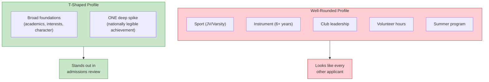
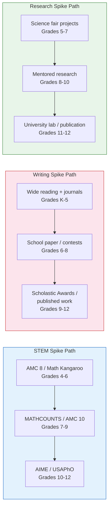
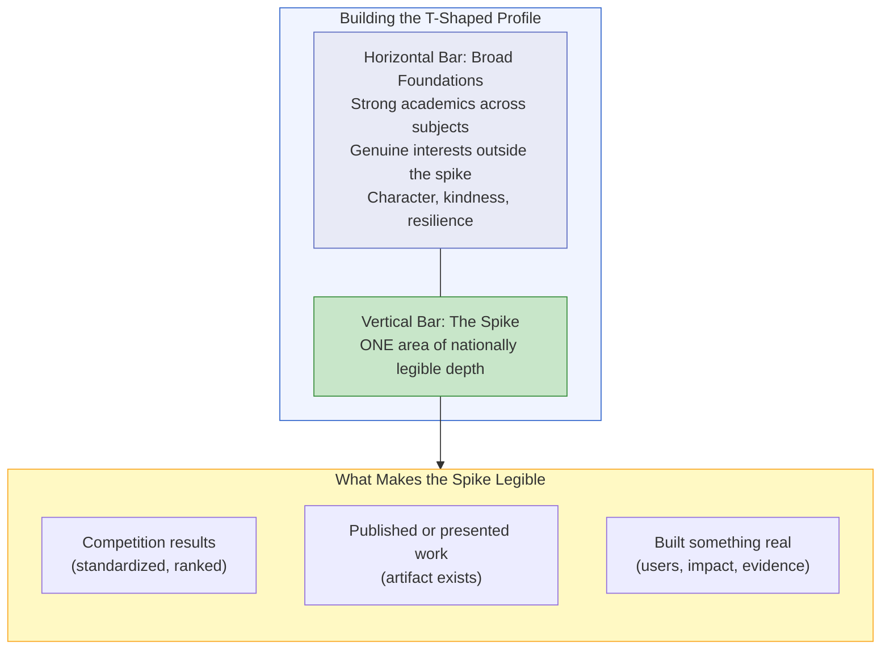

# Chapter 8: The Spike, Not the Well-Rounded Kid

> **Who this chapter is for:** T2/T3 readers — parents whose children are in elementary or middle school and who are starting to think about what makes a college application stand out for non-athlete families. You should read Chapters 1-5 first.

The previous chapters showed you what schools publish and what the numbers actually mean. This chapter answers the question that follows: if your child is not a recruited athlete, not a legacy, and not on the dean's interest list, what does a competitive non-athlete Ivy+ applicant actually look like? The answer, drawn from competition data and admissions patterns, is not "well-rounded." It is "T-shaped" — broad foundations with one unmistakable spike. [E]

---

You are at a school fundraiser, and the conversation has turned — as it always does — to college. A parent you know slightly is describing her eighth grader's schedule: travel soccer, piano, debate club, robotics, community service at a food bank, and a summer volunteer trip to Costa Rica. The child does each of these things competently. None of them at a level that would make a college admissions officer pause.

Another parent mentions, quietly, that her son just qualified for the MATHCOUNTS state competition — ranked eleventh in NorCal as a seventh grader. He does not play a sport. He does not do community service. He spends his weekends working through Art of Problem Solving textbooks. The first parent looks concerned. The second parent looks uncertain.

This chapter is for both of them.

---

## The Well-Rounded Trap

"Well-rounded" is the default Bay Area parenting strategy for college positioning. It means: do many things, do them reasonably well, demonstrate breadth. It is a strategy borrowed from an era when Ivy League admissions looked for gentlemen scholars — an era that ended roughly thirty years ago.

Here is the problem with well-rounded in 2026: it is the default. When every applicant from a competitive Bay Area private school has a sport, an instrument, a club leadership position, volunteer hours, and a summer program, none of those signals differentiate. They become table stakes — necessary but not sufficient. A well-rounded profile from Harker or Menlo or Gunn looks nearly identical to a well-rounded profile from Exeter or Stuyvesant or Thomas Jefferson. Admissions officers reading 200 Bay Area applications will see the same pattern repeated, with minor variations. [D]

What does cut through? Something that cannot be easily replicated. A result, a body of work, or a level of depth that signals genuine intellectual commitment rather than strategic box-checking. Coaches who work with Bay Area families applying to Ivy+ schools consistently report that the strongest non-athlete admits fall into a handful of recognizable categories. [D]

---

## What Non-Athlete Ivy+ Admits Actually Look Like

Based on competition data, admissions consulting patterns, and the profiles visible in our dataset, non-athlete Ivy+ admits from Bay Area schools cluster into several types: [D/E]

**The STEM competitor.** AIME qualifier, USAPhO medalist, USABO semifinalist, or equivalent. This is the most legible signal in STEM admissions — the competition results are nationally standardized, the difficulty levels are known, and admissions officers can calibrate exactly where the student falls. Our data shows Bay Area students earning multiple USAPhO medals across consecutive years: at Valley Christian, Jamin Xie earned Gold medals three consecutive years (2022-2024); at Monta Vista, Allen Li progressed from HM to Silver to US Physics Team member across the same window. [A]

**The research contributor.** Published or presented research, typically in a university lab setting, during junior or senior year. This is most common at schools with strong university connections — Harker and Gunn students have access to Stanford labs; Nueva encourages independent research projects. The signal is stronger when the research produces a tangible output (a paper, a poster, a dataset) rather than just "worked in Dr. X's lab." [D]

**The creative portfolio.** Competitive writing awards (Scholastic Gold Key, national-level poetry/fiction), published journalism, or a significant creative body of work. This is rarer in Bay Area profiles than STEM and therefore more differentiating at STEM-heavy schools like Harker or Lynbrook. [D]

**The builder.** A student who created something real — an app with actual users, a nonprofit with measurable impact, a community organization they founded and ran. The signal is the artifact itself, not the resume line. [D]

**Figure 8.1:** The well-rounded profile produces undifferentiated applications. The T-shaped profile — broad foundations plus one deep, legible spike — creates the contrast admissions officers remember.

---

## The Math Competition Pipeline: A Case Study in Spike Building

Math competitions are the most structured, most legible, and most data-rich spike pathway for Bay Area students. The pipeline is well-defined, the milestones are nationally standardized, and the competition results are public — which means we can trace actual student trajectories rather than relying on anecdotes.

Here is the pipeline, from entry to elite: [A]

| Level | Typical Grade | What It Tests | Score Benchmark |
|-------|--------------|---------------|-----------------|
| Math Kangaroo | K-6 | Pattern recognition, number sense | Top 5% for encouragement |
| MOEMS (Math Olympiad for Elementary/Middle Schools) | 4-8 | Problem solving, multi-step reasoning | Awards at regional level |
| AMC 8 | 6-8 | Middle school competition math | Score 20+ (out of 25) is top ~5% nationally |
| MATHCOUNTS (chapter → state → national) | 6-8 | Speed + depth; the major middle school competition | State qualifier is top ~25% of chapter; state top 4 go to nationals |
| AMC 10/12 | 9-12 | High school competition math | AMC 10: 100+ for AIME floor; AMC 12: 85+ for AIME floor |
| AIME (American Invitational Mathematics Exam) | 9-12 | Proof-adjacent problem solving | Score 7+ puts you in strong range; 10+ is USAMO-contention |
| USAMO/USAJMO | 9-12 | Full proof-based olympiad math | Qualifier status itself is the signal |

For physics, the pipeline runs: F=ma exam → USAPhO semifinalist → medalist (HM/Bronze/Silver/Gold) → US Physics Team (top 20). [A]

### What Our Data Shows

**MATHCOUNTS trajectories.** In NorCal State competition data (2024-2026), only two students appeared in the top 25% of individuals all three years: Dylan Wang (Bullis Charter School, ranked #11 → #6 → #1) and Yichen Wu (BASIS Independent Silicon Valley, ranked #2 → #4 → #13). [A]

Dylan Wang's trajectory is instructive. He went from eleventh in the state as a sixth or seventh grader to first in the state by eighth grade. That trajectory — steady, visible improvement over multiple years in a nationally standardized competition — is exactly the kind of signal that reads clearly in a college application four years later. It is not "my child likes math." It is "my child was ranked first in NorCal MATHCOUNTS." [A/E]

Consider a micro-case. A family we'll call the Lins have a fifth grader who scores well on AMC 8 practice tests — around 18-19 out of 25. The Lins are deciding whether to invest in competition math training. The question is not whether their daughter enjoys math (she does) but whether the competition pipeline is worth the time investment. What the data shows: students who reach MATHCOUNTS state level typically started AMC 8 preparation by fifth or sixth grade and trained with structured programs (AoPS, RSM, or dedicated competition coaches) for two to three years before competing at the state level. The pipeline requires sustained, focused effort — not casual participation. If the Lins' daughter has the interest and the aptitude, starting AMC 8 preparation in fifth grade puts her on a realistic timeline for MATHCOUNTS competitiveness in seventh and eighth grade. If she does not have strong intrinsic motivation for problem solving, no amount of parental investment will produce a genuine spike. [D/E]

**USAPhO trajectories.** The physics competition data tells a similar story of sustained depth. In our dataset, Jamin Xie (Valley Christian High School) earned USAPhO Gold in 2022, 2023, and 2024 — three consecutive Gold medals, a level achieved by very few students nationally. Canis Li, also at Valley Christian, went Silver → Gold → Gold across the same years. At Gunn, Roger Fan went HM → Gold → Gold. These are not students who dabbled in physics. They are students who committed deeply over multiple years. [A]

The school distribution is revealing. Valley Christian — not typically mentioned in the same breath as Harker or Nueva — produced six USAPhO Gold medalists across 2019-2024, tied with Lynbrook and behind only Saratoga among Bay Area schools. Harker produced five Golds. Mission San Jose (a public school) produced two Golds. The point: elite competition results come from individual student commitment, not from the school's brand. A dedicated physics student at Valley Christian can build a stronger spike than a diffuse well-rounded student at Harker. [A/E]

---

## The Writing Investment

STEM competitions get the most attention in Bay Area parent circles because the results are quantifiable and the pathways are legible. But the writing investment deserves serious consideration, particularly for students who are strong but not exceptional in STEM. [E]

Here is why writing matters for college admissions:

**Every application requires it.** The Common App essay, supplemental essays, and "Why Us" essays are load-bearing documents. A student who can write clearly, specifically, and with genuine voice has an advantage that compounds across every application. [D]

**Strong writing is rare in STEM-heavy applicant pools.** At schools like Harker (64% Asian, heavy STEM culture) and Lynbrook (similarly STEM-dominant), a genuinely excellent writer stands out precisely because the pool skews toward quantitative strength. Coaches who work with Bay Area applicants consistently report that the most successful non-STEM differentiators are strong writing — not in the sense of literary fiction, but in the sense of clear, specific, perspective-revealing prose. [D]

**Writing competitions are less saturated than STEM competitions.** Scholastic Art & Writing Awards, the Concord Review (for history essays), and national-level journalism awards draw far fewer Bay Area applicants than AMC or MATHCOUNTS. A Scholastic Gold Key in writing is a genuine differentiator; another AMC 10 qualifier from Harker is less so. [D/E]

The catch: writing ability is harder to develop through structured programs than math competition skills. AoPS has a clear curriculum. Writing development is messier — it requires reading widely, writing frequently, getting honest feedback, and revising without formulas. The families who invest in writing typically do so through sustained reading habits (starting in elementary school), regular writing practice (journals, essays, creative work), and selective use of writing workshops or mentors in middle and high school. [D/E]

**Figure 8.2:** Three major spike pathways with typical grade-level progression. STEM is the most structured; writing is the least structured but most differentiating in STEM-heavy applicant pools; research requires university access.

---

## What This Chapter Is Not Saying

This chapter is not saying every child needs a spike. Some children thrive as genuinely broad, curious learners, and they will find excellent college options — just not necessarily at the most selective Ivy+ schools, where the admit rates for undifferentiated well-rounded profiles are in the low single digits. That is not a failure. It is a mismatch between strategy and target.

This chapter is not saying parents should manufacture a spike. A spike that originates from parental pressure rather than genuine student interest is visible in applications and fragile under interview. Admissions officers who have read thousands of applications describe a specific pattern: the student whose "passion project" dissolves the moment the application is submitted. Forced spikes do not survive scrutiny. [D]

This chapter is not saying STEM competitions are the only path. They are the most legible path — the one where the signal is clearest and most standardized. But a student who builds a genuine body of creative work, or who contributes meaningfully to a research project, or who creates something real in the world, has a spike that reads just as clearly. The key word is *genuine*. The second key word is *deep*.

This chapter is not saying well-rounded is bad. It is saying well-rounded is *insufficient* at the most selective tier. A T-shaped profile includes breadth — that is the horizontal bar of the T. The spike is the vertical bar that makes the profile memorable.

---

## The Uncomfortable Math

Here is the math that most parents avoid. At a school like Harker, with roughly 260 graduates per year, approximately 46 enroll at Ivy+ schools annually (139 over three years). Remove estimated athletes (Harker does not publish this data, but competitive Bay Area private schools typically send 10-20% of Ivy+ admits through athletic recruitment). Even using a conservative 15% athlete estimate, the non-athlete Ivy+ count is roughly 39 per year from a class of 260 — about 15%. [A/E]

That means 85% of non-athlete Harker graduates — students at one of the Bay Area's most academically intense schools — do not enroll at Ivy+ colleges. They go to excellent schools: Carnegie Mellon (27 over three years), Purdue (25), UC Berkeley (26), UCLA (17). These are strong outcomes by any measure.

The students who do land in the Ivy+ tier disproportionately fall into the categories described above: STEM competitors, researchers, creative standouts, or builders. They are not students who did everything competently. They are students who did one thing exceptionally. [D/E]

Consider the Chens again — you met them in Chapter 1. Their daughter is now in eighth grade, plays violin, does robotics, and is a strong student. She is well-rounded. She is also indistinguishable from fifty other eighth graders at SHP with similar profiles. The Chens' realization, after reading the data in this book: their daughter does not need to drop violin or quit robotics. She needs to go deeper in one of them — or in something else entirely — until the depth is visible from the outside. The T-shaped strategy is not about subtraction. It is about addition at one specific point. [E]

And the Patels — from Chapter 1, the engineering parents who ask the hard questions at school tours. Their son is in sixth grade and has just scored 21 on the AMC 8. They now face a decision: invest in the competition math pipeline (which means AoPS courses, weekend practice, potentially MATHCOUNTS coaching) or keep math as one of several activities. The data in this chapter does not tell them what to do. It tells them what the competitive landscape looks like, so they can make the decision with open eyes. [E]

---

## The Spike Spectrum

Not every spike needs to be at the national level. The signal needs to be legible and deep, but the threshold varies by the selectivity of the target schools. [E]

| Spike Level | What It Looks Like | Signal Strength |
|-------------|-------------------|-----------------|
| National elite | USAMO qualifier, USAPhO Gold/Team, Scholastic national medalist | Strongest — reads clearly at Harvard/MIT/Stanford |
| National competitive | AIME qualifier (score 7+), USAPhO Silver/Bronze, Scholastic Gold Key | Strong — differentiator at most Ivy+ schools |
| State/regional notable | MATHCOUNTS state top 10, regional science fair winner, published in state journal | Moderate — differentiator at T20-T30 schools |
| School/local standout | Best in school at X, local competition winner, school paper editor | Baseline — necessary but not differentiating at Ivy+ tier |

The honest assessment: for Ivy+ admissions as a non-athlete, non-legacy applicant from a competitive Bay Area school, you generally need a spike at the "national competitive" level or above to meaningfully move the needle. A state-level spike combined with strong academics and compelling essays can work, but the margins are thin. [D/E]

**Figure 8.3:** The T-shaped profile requires both a broad foundation (the horizontal bar) and a deep spike (the vertical bar). The spike must be legible through one of three signal types: competition results, published work, or built artifacts.

---

## Quick Reference

| Question | Answer |
|----------|--------|
| Is "well-rounded" enough for Ivy+? | Generally no. It is table stakes, not a differentiator, at competitive Bay Area schools. |
| What makes a strong spike? | Nationally legible depth: competition results, published work, or built artifacts. |
| When should spike development start? | The pipeline typically begins in grades 4-6 for STEM competitions; earlier for reading/writing foundations. |
| Does the school matter for spike building? | Less than you think. Valley Christian produced more USAPhO Golds than Harker. The spike comes from the student, not the school brand. |
| What if my child has no clear spike? | That is normal through middle school. Expose broadly, watch for intrinsic pull, then invest deeply when it appears. Do not force it. |
| Can a spike be manufactured? | No. Forced spikes are visible in applications and fragile under scrutiny. The spike must come from genuine interest. |
| MATHCOUNTS state — how competitive? | In NorCal, only two students maintained top-25% state rankings across three consecutive years (2024-2026). It is genuinely hard. |
| USAPhO medal — how rare? | In 2024, California produced 108 semifinalists out of 290 nationally. Earning any medal from this pool is a strong signal. |

---

## Chapter Evidence Note

This chapter relies primarily on **Tier A** (official competition data), **Tier D** (community and coaching patterns), and **Tier E** (author synthesis) evidence.

**Tier A claims:** MATHCOUNTS NorCal State rankings (2024-2026) from CSPEEF/cspeef.org published results — Dylan Wang's #11 → #6 → #1 trajectory, Yichen Wu's multi-year appearances. USAPhO medal listings (2019, 2022-2024) from AAPT published PDFs — Jamin Xie's three Gold medals, Canis Li's Silver → Gold → Gold, Roger Fan's HM → Gold → Gold, Valley Christian's six Golds, school leaderboard rankings. Competition structure (AMC 8/10/12, AIME, USAMO, MATHCOUNTS, USAPhO tiers) from official organizer publications (MAA, AAPT, MATHCOUNTS Foundation).

**Tier D claims:** That admissions officers look for spikes over well-rounded profiles, that the strongest non-athlete admits cluster into STEM/research/creative/builder categories, that forced spikes are visible in applications, that writing ability is particularly differentiating in STEM-heavy applicant pools — these are patterns consistently reported by admissions consultants, coaches, and AoPS forum communities. They are not from controlled studies.

**Tier E claims:** The T-shaped framework, the "spike spectrum" calibration, the interpretation that competition data reveals what Ivy+ admits look like, the uncomfortable math on Harker's non-athlete rates (which involves estimation since Harker does not publish athlete data), and the micro-case recommendations — these are author synthesis.

*Competition score benchmarks and qualification thresholds change periodically. Verify current cutoffs with MAA (for AMC/AIME), AAPT (for USAPhO), and MATHCOUNTS Foundation before building a multi-year plan.*
