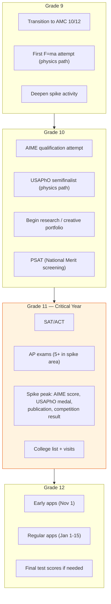

# Chapter 9: Grade by Grade — What to Build When

> **Who this chapter is for:** T1/T2 readers — parents with children in elementary or middle school who want a concrete framework for what to prioritize at each stage. No prior competition or admissions expertise assumed, but reading Chapters 1, 4, and 8 first will give you essential context.

This chapter is the timeline that the rest of the book has been building toward. The previous chapters showed you what schools publish, what the real numbers are, how structural advantages work, and what a competitive non-athlete profile looks like. This chapter puts it all on a calendar — grade by grade, from K through 12 — so you know what matters when, what can wait, and what cannot be recovered once the window closes. [E]

---

It is a Wednesday evening and you are sitting across from your spouse, a spreadsheet open on the laptop, trying to map out the next twelve years. Your child is in second grade. She likes drawing, asks interesting questions about bugs, and is reading slightly above grade level. You know — from the data in this book — that the Bay Area college placement numbers are more complicated than the brochures suggest. You also know that somewhere between now and twelfth grade, decisions will accumulate that shape her options. You do not want to over-optimize her childhood. You also do not want to wake up in ninth grade realizing you missed a window.

This chapter is the map. It is not a prescription. Not every child should follow this timeline. Not every family should care about every phase. But the windows are real, the timelines are grounded in data, and knowing the framework lets you make conscious choices rather than reactive ones.

---

## The Four Phases

The K-12 journey divides into four phases, each with a different strategic function. What you build in each phase determines what is possible in the next. [E]

```mermaid
flowchart LR
    subgraph Phase1["Phase 1: Foundations<br/>Grades K-2"]
        direction TB
        P1A["Reading fluency"]
        P1B["Number sense"]
        P1C["Curiosity habits"]
    end
    subgraph Phase2["Phase 2: Exploration<br/>Grades 3-5"]
        direction TB
        P2A["Competition entry"]
        P2B["Writing investment begins"]
        P2C["Interest discovery"]
    end
    subgraph Phase3["Phase 3: Commitment<br/>Grades 6-8"]
        direction TB
        P3A["School choice decision"]
        P3B["Spike development"]
        P3C["MATHCOUNTS / AMC 8"]
    end
    subgraph Phase4["Phase 4: Execution<br/>Grades 9-12"]
        direction TB
        P4A["Spike deepening"]
        P4B["Testing + applications"]
        P4C["College positioning"]
    end
    Phase1 --> Phase2 --> Phase3 --> Phase4

    style Phase1 fill:#e8f5e9,stroke:#2e7d32
    style Phase2 fill:#e3f2fd,stroke:#1565c0
    style Phase3 fill:#fff3e0,stroke:#e65100
    style Phase4 fill:#fce4ec,stroke:#c62828
```

**Figure 9.1:** The four phases of K-12 development. Each phase builds on the previous one. Skipping foundations (Phase 1) or exploration (Phase 2) creates gaps that are difficult to fill later.

---

## Phase 1: Foundations (Grades K-2)

**What this phase is for:** Building the substrate that everything else grows on. Nothing in this phase is about college. Everything in this phase matters for college.

**Reading.** This is the single highest-leverage investment in the first three years of school. Not reading instruction — your school handles that. Reading *volume*. Children who read widely and voraciously by the end of second grade have a vocabulary and comprehension advantage that compounds every year. The mechanism is simple: a child who reads 30 minutes a day encounters roughly 1.8 million words per year. A child who reads 5 minutes a day encounters about 280,000. By fifth grade, the cumulative gap is tens of millions of words — and that gap drives reading comprehension, writing ability, background knowledge, and test performance for the next decade. [B/E]

What to do: Read aloud daily through first grade. Build independent reading habits by second grade. Let the child choose books. Do not restrict to "educational" material — series fiction, graphic novels, and science books all build fluency. The goal is a child who reaches for a book without being told.

**Math foundations.** Number sense, not acceleration. The Bay Area instinct is to push children ahead — "she's doing third-grade math in first grade." This is usually counterproductive. A child who can do multi-digit arithmetic but does not understand *why* carrying works, or who can recite multiplication tables but cannot reason about groups and quantities, has a fragile foundation. The children who later excel in competition math almost universally had strong number sense — the ability to play with numbers, estimate, decompose, and reason flexibly — not early acceleration. [D/E]

What to do: Play math games (dice, cards, board games with strategy). Ask open-ended math questions ("How many ways can you make 24 from four dice?"). If your school offers math enrichment, look for programs that emphasize reasoning over speed. Beast Academy (the Art of Problem Solving elementary program) is widely used by competition math families, but it is not necessary in K-2. [D]

**Curiosity habits.** The least tangible and most important investment. Children who learn to ask "why" and "what if" — and who are given the space to pursue their questions — develop the intrinsic motivation that drives every spike described in Chapter 8. You cannot install curiosity in eighth grade. You can protect and nurture it in kindergarten. [E]

A micro-case. A family we'll call the Nguyens — you met them in Chapter 1, with a first grader — are wondering what they should be doing right now. The answer from this framework: reading, reading, and more reading. Their son likes bugs. They buy him field guides. They let him watch nature documentaries. They take him to tide pools. They do not sign him up for a coding bootcamp or a math acceleration program. In second grade, he starts reading chapter books about insects. By fourth grade, he will have a knowledge base in entomology that most adults lack. Whether that becomes a spike is not the point right now. The point is the habit of going deep on something that fascinates him. [E]

---

## Phase 2: Exploration (Grades 3-5)

**What this phase is for:** Discovering what the child is naturally drawn to, introducing structured challenge for the first time, and beginning the two investments that take the longest to mature: writing and competition math.

**Competition math entry.** Third through fifth grade is the natural entry point for math enrichment beyond school curriculum. The on-ramp: [A/D]

| Grade | Entry Point | What to Expect |
|-------|------------|----------------|
| 3rd | Math Kangaroo, Beast Academy | Exposure to non-routine problems; see if the child lights up |
| 4th | AMC 8 practice, MOEMS | First encounter with timed math competition format |
| 5th | AMC 8 (official), Beast Academy Level 5 | Target score: 15+ (out of 25) as first real benchmark |

The AMC 8 is the key diagnostic. It is administered in November to students in grades 8 and below. A fifth grader scoring 15+ is tracking well. A fifth grader scoring 20+ is in the top tier nationally for that age and should consider serious competition math investment. The Lins from Chapter 8 — whose fifth grader scores 18-19 on practice tests — are in this window. [A/D]

**The writing investment begins.** This is the phase where reading volume starts converting into writing ability — if the child writes regularly. Most Bay Area schools assign minimal creative or expository writing in grades 3-5. Families who want writing to be a strength by high school need to supplement. [D/E]

What to do: Encourage a journal or blog (the format matters less than the habit). Look for writing-focused summer programs. Read the child's writing and respond to the ideas, not just the mechanics. A child who writes regularly from third grade will have a meaningfully different relationship with language by eighth grade than one who starts writing seriously in ninth. [E]

**Interest discovery.** This is the phase for breadth — not as a college strategy, but as genuine exploration. Let the child try robotics, theater, coding, art, a sport, an instrument. Watch for what generates intrinsic pull: the activity the child returns to without being prompted, the topic they talk about at dinner without being asked, the book they stay up late reading. The exploration phase is not about committing. It is about identifying what, if anything, has the energy to become a spike. [E]

---

## Phase 3: Commitment (Grades 6-8)

**What this phase is for:** Three critical decisions converge in middle school — school choice, spike commitment, and competition pathway selection. This is the highest-leverage window in the K-12 timeline.

### The School Choice Decision Point

Sixth grade is the major private school entry point for several of the schools profiled in this book. Menlo, Castilleja, Crystal Springs, and Woodside Priory all start at sixth grade. Harker and Nueva admit at multiple entry points, but sixth grade is one of the largest cohort intakes. [A]

This is the moment when the data from earlier chapters becomes actionable. If you are at a K-5 school and considering a switch for middle school, the comparison is not just about prestige or social fit — it is about the infrastructure that supports spike development. A school with a strong MATHCOUNTS team, active science fair culture, and research connections offers different developmental infrastructure than one without. (Chapter 10 covers the transfer decision in detail.)

### MATHCOUNTS: The Middle School Proving Ground

MATHCOUNTS is the dominant math competition for grades 6-8, and the NorCal state data reveals how the pipeline works in practice. [A]

In our data (2024-2026 NorCal State), the top state competitors come from a concentrated set of schools:

| School | Type | 3-Year State Top 25% Count | Best Individual Rank |
|--------|------|---------------------------|---------------------|
| BASIS Independent SV | Private | 19 students | #1 (Alex Zhan, 2024) |
| Joaquin Miller MS | Public | 6 students | #1 (Justin Kim, 2025) |
| Bullis Charter | Public charter | 5 students | #1 (Dylan Wang, 2026) |
| The Harker School | Private | 7 students | #5 (Vihaan Gupta, 2024) |
| Hopkins MS (Fremont) | Public | 6 students | #3 (Ali Zaman, 2024) |
| The Nueva School | Private | 7 students | #11 (Atticus Lin, 2025) |

Two patterns stand out. First, public and charter schools are well-represented. Hopkins Middle School (a public school in Fremont) produced national team members in both 2024 and 2025. Bullis Charter (a public charter in Los Altos) produced the 2026 NorCal #1. You do not need to be at an elite private school to compete at the highest level. [A/E]

Second, the students who reach the top improve over multiple years. Dylan Wang went #11 → #6 → #1. William Tao (Joaquin Miller) went #26 → #4. Jonathan Li (Redwood MS) went #48 → #9. The trajectory tells you more than any single year's ranking. A seventh grader ranked 40th in the state who improves to 10th by eighth grade is building real momentum. [A]

Consider a micro-case. A family we'll call the Patels — you met them in Chapter 1 — now have a son in sixth grade who scored 21 on the AMC 8. He qualifies for the MATHCOUNTS chapter competition. He finishes in the top 30% at chapter but does not advance to state. This is a diagnostic moment. The gap between chapter qualifier and state competitor is significant — it typically represents 6-12 months of dedicated training with competition-specific material (AoPS Intro series, past MATHCOUNTS tests, possibly a coach or training group). The Patels' decision: invest in that training for seventh and eighth grade, or keep math as one of several interests. Both are valid choices. The data simply shows what the competitive landscape looks like. [A/E]

### Spike Commitment

By eighth grade, the child's emerging interests should start narrowing toward one or two areas of depth. This is not about closing doors — it is about opening specific ones wider. The student who has been exploring broadly in Phase 2 now has enough experience to know what generates real energy. [E]

The question to ask: "If you could spend every Saturday for the next year on just one thing, what would it be?" If the child has no answer, that is fine — Phase 3 can extend into ninth grade. If the child has a clear answer, invest in that answer. The spike described in Chapter 8 typically begins its visible development in grades 7-9.

---

## Phase 4: Execution (Grades 9-12)

**What this phase is for:** Deepening the spike, performing on standardized tests, and building the application. The strategic decisions narrow significantly; most of the optionality was spent in Phases 2-3.

### Grade 9-10: Deepening

This is when MATHCOUNTS competitors transition to AMC 10/12 and potentially AIME. The physics pathway opens: F=ma exam (typically taken in sophomore or junior year), leading to USAPhO qualification. [A]

From our USAPhO data, the multi-year medalists are overwhelmingly juniors and seniors. The 2024 Bay Area medalists included: [A]

- Students on the US Physics Team (top 20 nationally): Rohan Bodke (Homestead, 3 years of medals), Agastya Goel (Gunn, 3 years), Allen Li (Monta Vista, 3 years)
- Multiple Gold medalists: Jamin Xie (Valley Christian, 3 Golds), Canis Li (Valley Christian, Silver + 2 Golds), Roger Fan (Gunn, HM + 2 Golds)

These students all started earning USAPhO recognition in sophomore or junior year, with their peak results in junior or senior year. The timeline matters: a student who first takes F=ma in senior year has one shot, no trajectory to show, and no time to recover from a weak result. Starting in sophomore year provides two to three years of visible improvement. [A/E]

### Grade 11: The Critical Year

Junior year is the make-or-break year for Ivy+ positioning. By the end of junior year, you need: [D/E]

- SAT/ACT score (most students take it spring of junior year or fall of senior year)
- A spike that has produced concrete, externally legible results
- A preliminary college list informed by the data in Chapters 4-7
- Teacher relationships strong enough to produce compelling recommendation letters

The data from Chapter 7 adds a layer: if legacy or Early Decision is part of the strategy, junior year is when those decisions solidify. A family planning to apply ED to a parent's undergraduate alma mater should visit and demonstrate interest during junior year. [E]

**Figure 9.2:** The high school execution timeline. Junior year (Grade 11) is the critical convergence point where test scores, spike results, and college strategy must align. Starting spike development in senior year is too late.

### Grade 12: Execution

By senior year, the profile is largely set. The remaining work is application execution — essays, supplementals, and the strategic decisions covered in Chapter 7 (ED vs. RD, legacy leverage, demonstrated interest). The writing investment from Phase 2 pays off here. A student who has been writing regularly for eight years will produce college essays that are qualitatively different from those of a student who starts writing seriously in September of senior year. [E]

---

## What This Chapter Is Not Saying

This chapter is not a prescription. It is a framework. Not every child should do competition math. Not every family should aim for Ivy+ schools. The timelines here describe when specific windows open and close — not what you must do during them.

This chapter is not saying childhood should be strategized. The happiest, most successful students in our data are those whose spike emerged from genuine interest, not parental engineering. The framework exists so that when a child *does* show a natural pull, the parent knows how to support it at the right time.

This chapter is not saying late starters cannot succeed. Students who discover competition math in ninth grade or writing in tenth grade can still build strong profiles. But the data shows that the strongest competition results come from students with multi-year trajectories. A student who starts AIME preparation in eleventh grade is competing against students who have been training since seventh. The late starter can still succeed; the margins are just thinner. [E]

---

## The Timeline That Matters Most

If you remember nothing else from this chapter, remember this: the investments that have the highest leverage for college positioning are the ones that take the longest to mature. Reading volume (starts K, pays off through 12th). Writing habit (starts 3rd, peaks in application essays). Competition depth (starts 4th-6th, peaks in 10th-11th). Research ability (starts 8th-9th, peaks in 11th-12th). [E]

The investments with the lowest leverage are the ones parents tend to make most urgently: last-minute test prep, summer resume-building programs, application essay coaches hired in October of senior year. These are patches. The foundation was — or was not — built years earlier.

The Chens' daughter from Chapter 1 is now in eighth grade. If she has been reading voraciously since second grade, writing regularly since fourth, and building depth in robotics since sixth, she enters high school with a foundation that cannot be replicated by a student who starts from scratch in ninth grade. If she has not, ninth grade is not too late — but the path is steeper.

---

## Quick Reference

| Phase | Grades | Primary Investment | Key Decision | Window |
|-------|--------|-------------------|--------------|--------|
| Foundations | K-2 | Reading volume, number sense, curiosity | None — invest broadly | Permanent (builds compound interest) |
| Exploration | 3-5 | Competition math entry, writing habit, interest discovery | Start AMC 8 prep? | AMC 8 entry: grade 5-6 |
| Commitment | 6-8 | School choice, MATHCOUNTS, spike identification | Switch schools for 6th grade? Invest in spike? | MATHCOUNTS: grades 6-8 only |
| Execution | 9-12 | Spike deepening, testing, applications | ED strategy, college list | AIME/USAPhO: grades 10-11 peak; SAT: grade 11 |

| Competition | Typical Start Grade | Peak Grade | Key Benchmark |
|-------------|-------------------|------------|---------------|
| Math Kangaroo | 1-3 | 4-6 | Top 5% |
| AMC 8 | 5-6 | 7-8 | Score 20+ |
| MATHCOUNTS | 6-7 | 7-8 | State qualifier |
| AMC 10/12 | 8-10 | 10-11 | AIME qualification |
| AIME | 9-11 | 10-12 | Score 7+ |
| USAPhO (F=ma → semifinal) | 10-11 | 11-12 | Any medal |

---

## Chapter Evidence Note

This chapter relies primarily on **Tier A** (official competition data and school data), **Tier D** (community patterns), and **Tier E** (author synthesis) evidence.

**Tier A claims:** MATHCOUNTS NorCal State rankings and school team rankings (2024-2026) from CSPEEF published results. USAPhO multi-year medalist trajectories from AAPT published PDFs (2019, 2022-2024). Competition structures, score thresholds, and timelines from official organizer publications (MAA, AAPT, MATHCOUNTS Foundation). School grade ranges (Menlo 6-12, Crystal Springs 6-12, etc.) from school websites. Class sizes and Ivy+ placement counts from school profiles as detailed in Chapter 4.

**Tier B claims:** Reading volume research — the 30-minutes-per-day vs. 5-minutes-per-day word exposure comparison is derived from Anderson, Wilson, and Fielding's 1988 study of reading volume and achievement, widely cited in literacy research.

**Tier D claims:** That number sense matters more than early acceleration, that competition math families typically use AoPS/RSM/Beast Academy, that writing ability requires years of sustained practice, that the strongest Ivy+ non-athlete admits have multi-year spike trajectories, that admissions consultants advise junior year as the critical convergence point — these are patterns reported by coaches, tutors, AoPS forum communities, and admissions consultants. They are not from controlled studies.

**Tier E claims:** The four-phase framework, the grade-level recommendations, the "highest-leverage investments take the longest to mature" thesis, all micro-case interpretations, and the assessment that late starters face thinner margins — these are author synthesis based on the data presented in earlier chapters and the competition datasets.

*Competition schedules, registration deadlines, and qualification thresholds change annually. Verify current information with MAA (amc-reg.maa.org), AAPT (aapt.org/Programs/contests/), and MATHCOUNTS Foundation (mathcounts.org) before making commitments.*
