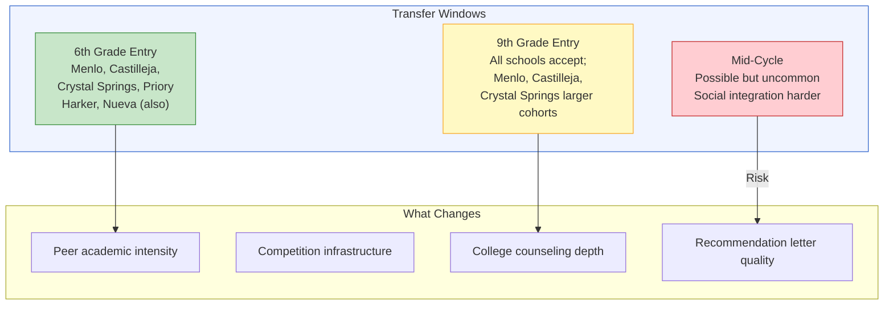
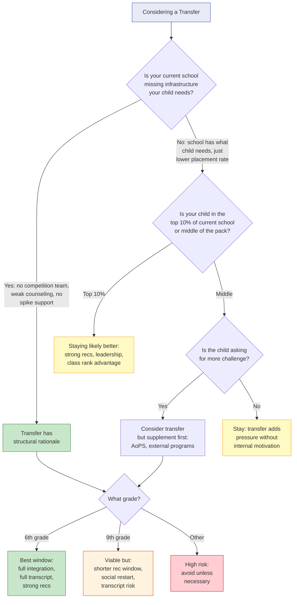

# Chapter 10: Should You Transfer Schools?

> **Who this chapter is for:** T2/T3 readers — parents at one Bay Area school who are considering whether a different school would improve their child's college placement outcomes. You should read Chapters 4, 6, and 8 first.

This is the chapter that every parent thinks about after seeing the comparison data. Menlo's estimated Ivy+ rate is 26%. Harker's is 18%. SHP's non-athlete rate is 10.5%. Gunn — a free public school — sends 33% of its class to Ivy+ colleges. The numbers create an obvious question: should we switch? This chapter answers that question with a framework, not a recommendation. The right answer depends on factors the data alone cannot resolve. [E]

---

You are lying awake at 11 PM on a Tuesday. Your child is in fourth grade at a K-8 private school on the Peninsula. The school is warm, the teachers know your daughter by name, and she is happy. You just finished reading Chapter 4 of this book. Your school does not publish Ivy+ data. The schools that do publish data — Menlo, Harker, Nueva — report numbers that make you wonder if you are at the wrong place. Menlo starts accepting students in sixth grade. The application window opens in ten months.

You are not sure if you are being rational or anxious. This chapter helps you tell the difference.

---

## The Transfer Windows

Bay Area private schools have three natural entry points where significant numbers of new students are admitted. Outside these windows, transfers are possible but cohorts are smaller and the social integration challenge is larger. [A/D]

**Sixth grade** is the single largest transfer window. Four of the eight private schools profiled in this book start at sixth grade: Menlo, Castilleja, Crystal Springs, and Woodside Priory. Harker and Nueva also admit sixth-grade cohorts, though they have K-5 programs that feed in. For families at K-5 schools, this is the primary decision point. [A]

**Ninth grade** is the second major window. Every school accepts some new students for ninth grade, though the cohort sizes vary significantly. Menlo, Castilleja, and Crystal Springs admit relatively larger ninth-grade cohorts because they do not have K-5 feeders — every student entered at sixth grade or later. Harker admits a modest ninth-grade cohort to supplement its K-8 pipeline. [A/D]

**Mid-year or off-cycle transfers** (e.g., moving from one school to another in seventh or tenth grade) are possible but uncommon. They typically happen for non-strategic reasons: a family move, a disciplinary situation, a serious social problem. Schools are more cautious about mid-cycle admits, and the student enters an established social ecosystem. [D]

**Figure 10.1:** The three transfer windows and the primary factors that change with each. Sixth grade offers the smoothest integration; mid-cycle carries the highest social risk and the greatest threat to recommendation letter quality.

---

## The Numbers That Tempt

Let's lay out the placement rates that drive the transfer conversation, using the data from Chapters 4 and 6: [A]

| School | Type | Ivy+ Rate (headline) | Data Window | Class Size | Key Caveat |
|--------|------|---------------------|-------------|------------|------------|
| Gunn | Public | 33.3% | 2024 single year | 447 | Single year; includes athletes; no decomposition |
| Menlo | Private | ~26.1% per year (est.) | 2023-2025 combined | 143-146 | 3-yr rolling; no athlete data; overlapping windows |
| Pinewood | Private | ~31.5% (min. est.) | 2022-2025 combined | 44-54 | 4-yr minimum counts; tiny class size |
| Castilleja | Private | ~21.6% (minimum) | 2025 single year | 51 | 1 year; no counts; minimum estimate |
| Palo Alto High | Public | 21.0% | 2024 single year | 476 | Single year; includes athletes |
| Harker | Private | ~17.8% per year (est.) | 2023-2025 combined | ~260 | 3-yr combined; no athlete decomposition |
| SHP (headline) | Private | 15.7% | 2021-2025 per year | 149-171 | Includes athletes |
| SHP (non-athlete) | Private | 9.5% | 2021-2025 per year | 149-171 | Only school with this decomposition |
| Crystal Springs | Private | ~3.9%/yr (min. est.) | 2022-2025 combined | 90 | Name list only; could be much higher |
| Lynbrook | Public | 15.7% | 2024 single year | 472 | Single year; heavy STEM culture |

These numbers are not directly comparable. Chapter 4 explained why: different schools use different counting methods, different time windows, and different definitions. The non-athlete rate — the number that matters most for families without a recruited athlete — is available only for SHP. For every other school, the headline rate includes an unknown athlete component. [A/E]

But parents look at these numbers and draw conclusions anyway. Menlo at 26% versus SHP non-athlete at 9.5% creates a 2.7x gap that feels significant. Harker at 18% versus a current school with no published data creates an information asymmetry that breeds anxiety.

---

## What You Gain by Transferring

### 1. Peer Academic Intensity

The most tangible gain from transferring to a higher-placement school is the peer environment. At Harker, 64% of UC applicants are Asian, the median SAT is likely above 1500, and the culture is intensely academic. A student who is the strongest math student at a smaller private school may find herself in the middle of the pack at Harker — and that recalibration can be productive. Competition sharpens. Expectations normalize upward. [C/E]

The MATHCOUNTS data illustrates this. Harker placed three students in the NorCal State top 10 in 2026 (Jeremy Zhang #5, Shiven Bhargava #6, Landon Wan #7). BASIS Independent Silicon Valley placed eight students in the state top 25% the same year. At these schools, competitive math is not a niche activity — it is a social norm. A student who transfers into this environment gains teammates, training partners, and a culture where academic striving is expected rather than unusual. [A/E]

### 2. College Counseling Depth

Schools with strong Ivy+ placement records typically have more experienced college counselors, closer relationships with admissions offices, and more institutional knowledge about what works. A counselor at Menlo who has placed hundreds of students at Stanford knows what those applications look like. A counselor at a smaller school with less placement history may be learning alongside the family. [D]

This advantage is real but hard to quantify. The counselor does not get the student in. The counselor helps the student present themselves accurately and strategically — and avoid the mistakes that come from not understanding how admissions offices operate. [D/E]

### 3. STEM and Competition Infrastructure

Some schools have competition teams, coaching support, and a pipeline that makes spike development easier. Harker's MATHCOUNTS team is state-champion caliber. Nueva encourages independent research projects. These institutional supports lower the friction of spike development — the student does not need to find external resources because the school provides them. [A/D]

### 4. Placement Rates (With All Caveats)

Yes, the placement rates are real. Even after all the caveats — athlete inclusion, data methodology differences, year-to-year volatility — schools like Menlo and Harker place a higher percentage of graduates at Ivy+ colleges than most alternatives. Whether this reflects the school's contribution (counseling, peer effects, preparation) or the school's intake (families who would have produced strong applicants regardless) is an open question that no dataset can fully resolve. [E]

---

## What You Lose by Transferring

### 1. Recommendation Letter Quality

This is the most underestimated cost of transferring. Strong recommendation letters come from teachers who have known a student for three to four years, who have seen them grow, struggle, and persist. A student who arrives at a new school in ninth grade has three years to build those relationships. A student who has been at the same school since sixth grade has seven. [D]

The difference is not trivial. Admissions officers consistently report that the strongest recommendation letters are specific, detailed, and grounded in multi-year observation. "I have taught Maria for four years and watched her transform from a hesitant contributor to the student who anchors every seminar discussion" reads differently than "Maria joined our school this year and has performed well in my class." [D]

A micro-case. A family we'll call the Sharmas — from Chapter 4, where they were comparing Harker and SHP — ultimately kept their son at SHP through eighth grade. He is now in ninth grade, and his math teacher has known him since sixth. That teacher's recommendation letter, when the time comes, will draw on four years of specific observation. If the Sharmas had transferred him to Harker in ninth grade, his strongest recommender would have known him for two years at most. The Sharmas decided the recommendation quality was worth more than the difference in headline placement rates. [E]

### 2. Community and Continuity

A child who has been at a school since kindergarten or sixth grade has deep friendships, trusted adults, and a sense of belonging that transfers cannot replicate. The social capital built over years of shared experience — the teacher who believed in them in fourth grade, the friend who has been their lab partner since seventh — has value that does not appear in placement data. [E]

This is not a sentimental argument. Social stability affects academic performance, mental health, and the quality of the student's college essays. A student who writes authentically about their community — the school, the teachers, the experiences that shaped them — has material that a student at a new school for two years does not. [D/E]

### 3. Grade Transcript Disruption

Transferring schools can create transcript complications. Different schools have different grading standards, different course sequences, and different GPA calculation methods. A student who earned an A- in honors math at one school might find themselves in a different track at the new school, creating a discontinuity that requires explanation. The disruption is usually manageable for sixth-grade transfers (the transcript is still forming) but more consequential for ninth-grade transfers (where every semester grade counts for college applications). [D]

### 4. The Selection Bias Problem

The uncomfortable question: do schools like Menlo and Harker produce better college outcomes, or do they select students who would have produced strong outcomes regardless? [E]

This is not fully answerable with available data. But consider: Menlo's admissions process is highly selective. The students who enter in sixth grade have already demonstrated academic strength, test-taking ability, and family investment. If those same students had remained at their previous schools, many would likely have produced strong college outcomes from different institutions.

The honest assessment: transferring probably provides a marginal advantage through counseling, peer effects, and institutional reputation. It probably does not provide the transformative advantage that the headline rate gap suggests. A student who would have been in the top 10% at their original school will likely be in the top 25% at a more competitive school — and the relevant question is which position produces a stronger application. [E]

---

## The Framework: When to Transfer and When to Stay

**Figure 10.2:** Decision framework for the transfer question. The key branching point is whether your current school lacks structural infrastructure (competition support, counseling depth, spike development) or simply has a lower headline placement rate. Rate differences alone rarely justify the costs of transfer.

### Transfer When:

- **Your current school lacks infrastructure** your child needs — no competition team, no research opportunities, weak college counseling — AND the target school demonstrably has it. This is a structural argument, not a rate argument. [E]
- **Your child is in elementary school** and you are choosing a sixth-grade entry school. This is the cleanest transfer: full integration time, full transcript at the new school, strong recommendation relationships. The social cost is lowest at this age. [D/E]
- **Your child is actively constrained** by the academic ceiling at the current school — top of every class, bored, asking for more — and supplementation (AoPS, external programs, university courses) is not sufficient. [E]

### Stay When:

- **The primary motivation is a higher headline placement rate.** Rate differences between schools reflect a mix of selection, athletics, and methodology that may not apply to your specific child. A student who is thriving academically and socially at their current school should not be uprooted for a rate delta. [E]
- **Your child is in the top 10-15% of their current school.** Being a standout at a slightly less competitive school can produce stronger recommendations, more leadership opportunities, and greater visibility to college counselors than being average at a more competitive school. The "big fish, small pond" effect is real and well-documented. [C/E]
- **The transfer would happen after eighth grade and your child has strong teacher relationships.** The recommendation letter cost of a ninth-grade transfer is significant. Unless the target school offers something your current school structurally cannot, the cost likely exceeds the benefit. [D/E]
- **Your child is happy, growing, and building genuine depth.** If the spike from Chapter 8 is developing at the current school — through external programs, self-study, or school-based activities — changing the school is unlikely to accelerate it and may disrupt it. [E]

---

## The Public School Question

Chapter 6 covered the private-versus-public comparison in detail. But the transfer framework raises a specific question: should a family at a private school consider moving to a public school?

The data is provocative. Gunn's Ivy+ rate of 33.3% (2024) exceeds every private school profiled. Palo Alto High's 21% exceeds SHP's headline rate. These public schools achieve these results with zero tuition. [A]

The transfer math: a family paying $55,000/year at a private school from sixth through twelfth grade spends approximately $385,000 on tuition. A family in the Palo Alto Unified School District pays property taxes and gets a school that, by the numbers, places as well or better. [A/E]

The caveats are important. Gunn's 33.3% is a single year with no athlete decomposition. The class size (447) means the Ivy+ count (149) may include significant athletic recruitment — Gunn has strong athletic programs. And accessing Gunn requires living in the PAUSD attendance area, where housing costs embed the "tuition" in mortgage payments. The decision is not as simple as the rate comparison suggests. [E]

But the point stands: for some families, particularly those in strong public school districts, the transfer question is not "which private school?" but "should we be at a private school at all?"

---

## What This Chapter Is Not Saying

This chapter is not saying transfers are bad. For some families and some children, transferring to a school with stronger infrastructure, better-matched peers, and deeper resources is the right move. The sixth-grade entry at Menlo, Crystal Springs, or Castilleja is a genuine opportunity for families at K-5 schools.

This chapter is not saying placement rates don't matter. They do. A school that consistently places 25% of graduates at Ivy+ colleges is doing something different from one that places 5%. The question is whether the delta is driven by the school's value-add or by its selection of already-strong students — and the answer is probably both, in proportions that vary by school.

This chapter is not saying you should stay at a bad school. If your current school has weak academics, poor counseling, or a culture that does not support your child's development, transferring is appropriate regardless of placement rates. The framework above assumes both schools are competent; the question is whether the marginal advantage of a "better" school justifies the costs.

This chapter is not recommending specific schools. The data shows what each school's published numbers mean. The decision about which school fits your child depends on factors — personality, learning style, social needs, commute, family values — that no dataset captures.

---

## The Exit Signal

If you have read this chapter and feel anxious — if the rates and comparisons have triggered a sense that you need to act immediately — pause. Anxiety-driven school switches are the most common regret pattern coaches and counselors report among Bay Area families. The families who are happiest with their transfer decisions are those who made them based on structural fit (what the school offers that matches what the child needs) rather than rate-chasing (moving toward higher numbers). [D/E]

The strongest signal that a transfer makes sense is not a number. It is your child outgrowing their environment in a specific, observable way — and the target school offering something concrete that addresses that specific gap.

The Chens — from Chapter 1, now with a daughter in eighth grade at SHP — briefly considered Menlo for ninth grade. SHP's non-athlete Ivy+ rate (9.5%) versus Menlo's estimated headline rate (26%) created an obvious temptation. But their daughter has a robotics mentor at SHP who has known her since sixth grade, a science teacher writing her a recommendation, and a group of friends she has grown up with. The Chens decided that what SHP gives their daughter — continuity, deep relationships, a known environment — is worth more than the rate delta. Menlo might have been the right choice if they were starting from scratch. It is not the right choice for disrupting something that is working. [E]

---

## Quick Reference

| Scenario | Recommendation | Key Reason |
|----------|---------------|------------|
| K-5, choosing 6th-grade school | Compare actively | Best transfer window; full integration time |
| Strong at current school, rate-chasing | Stay | Big fish, small pond; recommendation quality |
| Current school lacks competition/STEM infrastructure | Transfer or supplement | Spike development needs support |
| 9th-grade switch for placement rate | Usually stay | Rec letter cost + social restart usually > rate benefit |
| Private school, strong public school district available | Evaluate seriously | Data shows comparable or better outcomes at $0 tuition |
| Child is unhappy, constrained, or bored | Transfer regardless | Structural fit > rate optimization |

| Transfer Window | Integration Time | Rec Letter Quality | Social Risk | Best For |
|----------------|-----------------|-------------------|-------------|----------|
| 6th grade | 7 years | Excellent (teachers know student 6+ years) | Low | Families at K-5 schools |
| 9th grade | 4 years | Good (but shorter than lifers) | Moderate | Students who need a reset or access to specific programs |
| Mid-cycle | Varies | Compromised | High | Only when necessary (family move, serious problems) |

---

## Chapter Evidence Note

This chapter relies primarily on **Tier A** (official school data), **Tier D** (community patterns), and **Tier E** (author synthesis) evidence.

**Tier A claims:** School grade ranges (Menlo 6-12, Crystal Springs 6-12, Castilleja 6-12, Woodside Priory 6-12 — from school websites). Ivy+ placement counts and class sizes from school profiles as detailed in Chapter 4: SHP 5-year data (124 Ivy+ from 790 students, 15.7% headline; 75 non-athlete from 790, 9.5% non-athlete); Harker 3-year combined (139 Ivy+ from estimated 780 students, ~17.8%); Menlo 3-year rolling (112 Ivy+ from classes of ~143, ~26.1% estimated annual); Gunn single-year (149 Ivy+ from 447, 33.3%); Paly single-year (100 Ivy+ from 476, 21.0%). MATHCOUNTS school placements from CSPEEF published state results. Tuition estimates from school-published fees (2025-2026 academic year).

**Tier D claims:** That recommendation letter quality depends on relationship length, that mid-cycle transfers carry higher social integration risk, that the "big fish, small pond" effect is real for college applications, that anxiety-driven school switches are a common regret pattern, that the strongest transfer signals are structural rather than rate-based — these are patterns consistently reported by admissions consultants, school counselors, and parent communities. They are not from controlled studies.

**Tier E claims:** The transfer decision framework, the assessment that selection bias accounts for a significant portion of placement rate differences, the "what you gain / what you lose" analysis, all micro-case interpretations, and the recommendation that rate differences alone rarely justify transfer costs — these are author synthesis. The "marginal advantage" framing is a judgment call based on the data presented but is not proven by any controlled experiment.

*School admissions timelines, application deadlines, and cohort sizes change annually. Verify current entry points and deadlines directly with each school's admissions office before making transfer decisions.*
